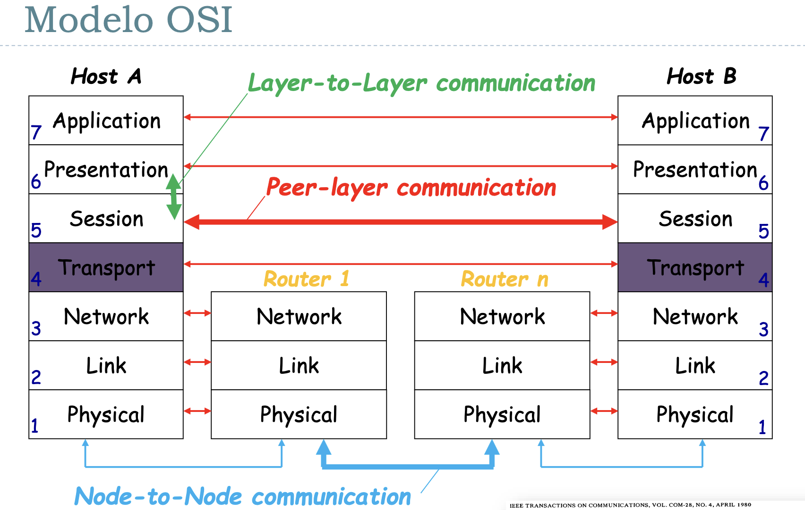

# Unidad 0 - Introducción, conceptos básicos

El primer invento similar a lo que conocemos hoy en día como redes de
comunicación fue la del telégrafo. Luego, le siguió la del teléfono, y ambos
tenían una cualidad que persistió hasta aproximadamente la década del 70: la
**conmutación de circuitos**.

La conmutación de circuitos como indica el nombre implicaba que haya operarios
encargados de conectar a las dos personas / aparatos que querían iniciar una
comunicación (cof cof, *operadora, comuníqueme con pirulito*)

Este approach tiene varias desventajas, por lo que mayoritariamente entre los
años 1959-1969 se desarrollaron las ideas que nos llevaron a la **conmutación
de paquetes**, cuyo objetivo principal era resultar en una red más tolerante a
fallas. Cómo se logró esto?

- Redundancia: que haya múltiples caminos entre dos puntos de la red
- Descentralizada: toleracia a censura
- División en fragmentos de los mensajes cosa de que puedan tomar caminos
  diferentes.

*ARPANET* (Advanced Research Projects Agency Network) fue uno de los más importantes.

## Estandarización

Las tecnologías de redes con conmutación de paquetes se suiguieron
desarrollando, terminando a mediados de los 80 con una situación en la que
tenías muchas redes distintas cada una con su implementación particular y sus
propios detalles. Se empieza a hablar de la idea de tener una red única (en
mayo de 1983 ISO publica “ISO 7498:The Basic Reference Model for Open Systems
Interconnection” como un estándar internacional)



El modelo OSI describe tódo lo que sucede con la información en una
comunicación entre dos puntos. Parte el proceso en 7 capas, en la que cada una
tiene un fin particular y cuyas entidades relevantes son definidas por eso. Por
ejemplo, en la capa de aplicación tu entidad puede ser un archivo mientras que
en la capa de de red tu entidad puede ser el paquete.

Si bien se usa el modelo OSI para estudiar teoría de comunicaciones, hoy en día
el verdadero ganador fue el modelo de TCP/IP, en donde hay 4 capas en lugar de
las 7 que propone OSI


```admonish info title="[osi the internet that wasnt](https://spectrum.ieee.org/osi-the-internet-that-wasnt)"
TLDR: OSI y TCP/IP compitieron durante un tiempo, pero una de las mayores
diferencias radicaba en que OSI era un protocolo que se estaba gestando por un
comité conformado por gente de la industria y cada uno quería tener su
influencia sobre el protocolo. Esto resultó en problemas para ponerse de
acuerdo y en un modelo que si bien era completo era mucho más difícil de
implementar, más caro y complejo. 

Mientras seguían discutiendo sobre el estándar de OSI, TCP/IP ya se estaba usando...
```

## Nivel Físico

### Sistema de Comunicaciones

Modelo: tengo fuente de info -> Emisor -> ----- canal de comunicación ----- -> Receptor -> Destino

- Qué es información?
- Qué es un canal?
    - guiado (cable)
    - no guiado (inalámbrico)
- **Siempre** me ingresa ruido (alto o bajo)

```admonish info title="Ejemplo"
Hablo en meet y tengo a mi gato maullando. Tengo que hablar más fuerte. Más
fuerte = mejor? Bueno no, lo que importa es la relación entre cuánto grito y el
ruido ambiente.
```

- Relación Señal / Ruido
- La señal tiende a atenuarse a mayor distancia. Si se achica la señal y el
  ruido es constante, entonces se achica la capacidad de transmisión también.
- Lo importante de señal:
    - Es una onda electromagnética
    - Se propaga a la velocidad de la luz (a un ~70% de la velocidad de la luz en el vacío)
    - *Demora*, no es instantáneo (es un límite físico, no lo puedo evitar)
        - **Tiempo de propagación**
        - RTT (Round Trip Time) entre USA y ARG = 100ms


Frecuencia \\(f\\) = Cantidad de ciclos que entran en un segundo

Longitud de onda \\(\lambda\\) = \\(c\\) (velocidad de la luz) \\(/ f\\) 

- a mayor frecuencia menor longitud de onda (\\(c\\) es constante)

Glosario:

- Amplitud
- Frecuencia Angular (= \\(2 \pi f\\))
- Frecuencia Temporal (\\(f\\))
- Período = \\(\frac{1}{f}\\)
- Fase (desplazamiento)

### Dominio Transformado

Lo anterior era orientado al dominio del tiempo. Idea: paso ese dominio a otro para procesarlo mejor:

- serie trigonométrica de fourier -> puedo representar ordas cuadradas como una serie infinita de senos y cosenos
    - permite descomponer la señal en las distintas frecuencias
- transformada de fourier
    - lo anterior en la teoría. Esto en la práctica
    - esto es lo que en la práctica permite descomponer una señal en sus distintas armónicas / componentes de frecuencia

### Ancho de banda

Rango de frecuencias senoidales que pueden pasar por el medio sin ser atenuadas (< 3db, esto es una generalización).

```admonish warning title="Pregunta de Final"
Tengo ancho de banda de 0 a 4 khz. Meto onda cuadrada periódica de 3khz en un canal con ancho de banda de 0 a 4khz. Qué obtengo a la salida?

Rta: Obtengo una onda senoidal de 3khz, porque la primera armónica tiene el
triple de frecuencia que la fundamental (en este caso es de 3 y la armónica ya
tiene 9), o sea que salvo la fundamental te filtra todo.
```

### Teoría de la información

(En el 48') Llega Shannon con su paper "A Mathematical Theory of
Communication". Ídolo, Genio, Maestro, Crack.

Idea fundamental: 

- No interesa el significado del mensaje (No me importa si es teléfono, tele, internet, etc.)
- **Teoría Clásica de la información**
- Propone 2 teoremas fundamentales:
    - Codificación para una fuente sin ruido
    - Codificación para un canal con ruido
- Sorprendentemente nunca habla de cómo implementar nada

Definición: qué es la información

$$
I(E) = log(\frac{1}{P(E)})
$$

La información que me da un evento es el logaritmo de la inversa de la
probabilidad de que ese evento suceda.

**Unidades**:

- log en base 2? *1 bit* (por qué? Si tengo un dígito binario equiprobable \\(I(\\)sale 0/1\\() = 1\\)
-  (hay otros)

### Fuente de Memoria Nula

Es el modelo que tomamos asumiendo que cada símbolo que emite es estadísticamente independiente del siguiente

```admonish info
Con una fuente de memoria nula, \\(E(s_i) = log(\frac{1}{P(s_i)})\\) bits
```

### Entropía

Viene a representar algo así como la cantidad media de info por símbolo de la fuente (similar a Esperanza).

$$
\sum_S P(s_i)I(s_i) \text{  bits}
$$

Es algo como la cantidad de info que voy a obtener cuando observo un símbolo / evento.

Cuándo maximizo la info que me van a dar los eventos? Cuando los eventos son equiprobables.

```admonish info title="offtopic recomendación"
3b1b tiene un video en el que habla de entropía y lo aplica al wordle

<iframe width="560" height="315" src="https://www.youtube.com/embed/v68zYyaEmEA" title="YouTube video player" frameborder="0" allow="accelerometer; autoplay; clipboard-write; encrypted-media; gyroscope; picture-in-picture" allowfullscreen></iframe>
```

### Extensión de la Fuente de Memoria Nula

En vez de considerar de a un bit, agrupo varios bits juntos


### Codificación

Codificación sería el proceso por el cual mappeamos los símbolos de la fuente a
símbolos de un alfabeto asociado. Por qué hacemos esto? En primer lugar porque
a veces no tenemos una representación sencilla con la que trabajar. Y segundo
porque dependiendo el tipo de codificación que usemos vamos a obtener una mejor
o peor eficiencia.

- Le decimos **código bloque** a una codificación que asigna cada símbolo de la
  fuente a una secuencia de símbolos del alfabeto destino.
- Si la codificación es una función **inyectiva**, decimos que la codificación
  es **no singular**
- Y decimos que una codificación es **unívocamente decodificable** si ninguna
  tira de símbolos del código (o sea los códigos generados) admite más de una
  única decodificación.
- Por último, decímos que un código es **instantáneo** si es posible
  decodificar sin ver los símbolos que suceden (no tiene que hacer look ahead)

```admonish info title="condicion de los prefijos"
Una condición **necesaria y suficiente** para que un código sea
**instantáneo**, es que no haya palabra en el alfabeto que sea prefijo de la
misma. Ojo, dos palabras pueden tener un mismo prefijo común siempre que el
mismo no pertenezca al alfabeto.

Teorema: Instantáneo => unívocamente decodificable
```

- En ascii tenemos 8 digitos binarios por símbolo
- Sin embargo, en morse tenemos una cantidad variable

Pensemos ahora que lo que mandamos son mensajes, y para representar cada
mensaje (\\(m_i\\)) lo representamos con una palabra de longitud \\(L_i\\). Y
nuestro símbolo se codifica con cadenas de un alfabeto de \\(r\\) símbolos.

Para esto último se define la **longitud media de un código**. Es la
probabilidad de ocurrencia de cada símbolo por su longitud. Sería como la
esperanza de la longitud de recibir un símbolo, o algo así.

$$
L = \sum{p_i L_i}
$$

Cómo lo minimizo? Al que más probabilidad tenga, le doy el código más chico. 

Otra cosa más, es que para asegurar que no haya pérdida de información requiero
que:

$$
L log(r) \geq H(S)
$$

Donde \\(log(r)\\) es la cantidad promedio máxima de info de un símbolo del código (por lo que vimos antes).

Definimos con esa desigualdad la **eficiencia de un código** \\(h\\) como:

$$
h = \frac{H(s)}{L log(r)}
$$

y \\(h_{max} = 1\\)

### Codificación de Huffmann

Es un método que permite construir codificadores óptimos en base a la
frecuencia en la que aparecen los símbolos (de la fuente).

## Medios de Transmisión Reales

Cualquier canal de comunicación:

- Está expuesto a ruido
- Tiene problemas de potencia
- Tienen problemas de ancho de banda

### Fórmula de capacidad de Shannon para un canal sujeto a ruido

$$
C_max(bps) = B(\text{hz}) log_2(1 + \text{SNR})
$$

```admonish info title="SNR para capacidad de Shannon"
La relación señal-ruido de la capacidad de Shannon se expresa como logaritmos:

$$
SNR_{db} = 10 log_{10}(\text{SNR}) = 10 log_{10}(\frac{\text{PotenciaSeñal}}{\text{PotenciaRuido}})
$$

Por qué la escala logarítmica? 

Es para ajustarse a las magnitudes. La atenuación es logarítmica, el oido tiene
respuesta logarítmica, etc. Y la escala logarítmica resulta más práctico (sobre
todo para visualizar)
```

### Intro a Nyquist

El ñato este tiró una fórmula para la capacidad máxima en canales **sin ruido**:

- 2 niveles:
$$
C = 2B(\text{Hz})
$$

- \\(M\\) niveles:
$$
C = 2B(\text{Hz})log_2(M)
$$

Sin embargo hay una restricción, \\(M\\) tiene que ser más chico que \\(\sqrt(1 + \text{SNR})\\)

```admonish warning title="Pregunta de final alert"
**Qué es el delay?**

Está formado por:

- el tiempo de propagación
- el tiempo de transmisión
- el tiempo de encolamiento
- el tiempo de procesamiento

Notar que sólo el tiempo de propagación ya te puede estar limitando porque
transmitimos casi a la velocidad de la luz y sin embargo para mandar 1 bit por
10000km por fibra tengo un tiempo de propagación aproximado de 50ms (y por lo
tanto 100ms de RTT).
```
