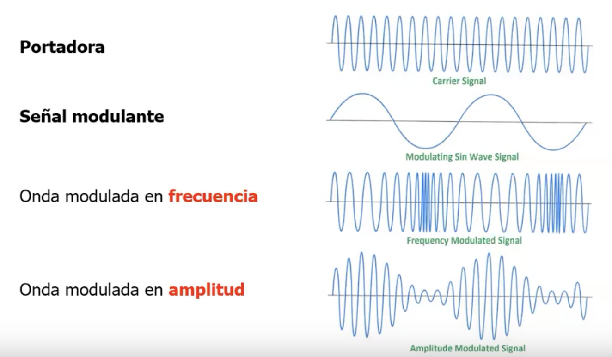

# Unidad 1 - Nivel Físico

La fórmula de Shannon pone un límite en la tasa de transmisión, pero no en la
probabilidad de error. En teoría se podría minimizar arbitrariamente la
probabilidad de error usando una codificación lo suficientemente combleja y
obviamente con \\(R_b \leq C\\). Al no cumplir esto último esa idea de
minimizar la probabilidad de error arbitrariamente ya no es posible.


Si graficamos la relación entre la SNR y la relación capacidad sobre ancho de
banda obtenemos el gráfico de arriba, que de alguna forma nos da valores para
lo que es posible y lo que no. En la práctica se busca asemejarse lo más
posible a la función graficada, buscando aumentar la cantidad de bits/s.

```admonish warning title="pregunta de final"
Tengo un canal de ancho de banda de 0 a 2 Mhz, cuál es la forma de la onda de
salida si inyecto una señal de 1 Mhz. Sólamente obtengo la fundamental ya que a
partir de la tercer armónica que no entra en el ancho de banda.
```

## Medios de transmisión

Hoy en día tenemos internet compuesta por provedores que tiene tecnologías de acceso:

- Fibra
- Cable
- Satélite
- Wifi
- Celular


Las ondas electromagnéticas "necesitan" (en realidad no necesitan nada, se
pueden propagar por el vacío) un **medio de transmisión** por el cuál
transmitirse. Pueden ser:

- Guiados: Cable
    - de cobre
    - coaxil
    - fibra óptica
- No guiados: El espacio, libre
    - por radio
    - microondas
    - ondas infrarojas
    - laser
    - satélite
    - luz

## Red telefónica

Vamos a tomar de ejemplo a la red telefónica ya que muchos de los conceptos se
replican en otros medios de tecnologías.

- mediante conmutación de circuitos

### Multiplexación

Multiplexar consiste en poder tener varias comunicaciones simultáneas en un
mismo troncal físico.

Podemos multiplexar:

- por tiempo: una suerte de round robin
- por división frecuencia: transmito a través de las distintas bandas
    - el circuito para esto suele ser más complejo
    - al tener menos ancho de banda es "más lento", pero tengo más uptime
- por división de onda: lo mismo que antes pero aplicado a sistemas ópticos


## Taxonomía de Redes

Las Redes de comunicaciones se pueden dividir en:

- Redes de conmutación de Circuitos
- Redes de conmutación de Paquetes
    - Redes con Circuitos Virtuales
    - Redes de Datagramas (en el 99.999% de la materia vemos esto)
        - servicio sin conexión
        - el nivel de transporte brinda soporte para dar servicio orientado a conexión también (ej: TCP)

Las redes de conmutación de paquetes se basan en el concepto de
**multiplexación estadística**. Mi conmutador tiene un buffer y despacha de a
poco en base a algún criterio en base a la dirección origen y destino de dichos
paquetes.

Esta idea también implica que cada paquete compite con otros por ser enviado y
puede llevarnos a situaciones de congestión.

## Conversión Analógico Digital

Tengo 2 Etapas:

1. Primero una etapa de muestreo
    - Gracias a Nyquist sabemos que debemos muestrear al doble del ancho de banda (por lo menos)
    - Además, tengo que definir con cuántos dígitos binarios uso para representar cada muestra
2. Segundo cuantifico dichas muestras (o sea mando el valor a su representación binaria correspondiente)
    - Hoy en día a esa técnica la llamamos *PCM* (**P**ulse **C**ode **M**odulation)


### Teorema del muestreo (Nyquist)

Si queremos Reconstruir una señal cuya frecuencia máxima es \\(f_m\\) debemos
muestrar dicha señal a una razón de \\(f_s > 2 * f_m\\) llamada **frecuencia de
muestreo**

```admonish info title="Ejemplo con red de computadoras "


Este es un diagrama (un poco antiguo). Las oficinas interurbanas operaban en
digital, por lo que era necesario que la señal originalmente analógica sea
convertida a una señal digital.

Uno en casa entonces tenía un modem, que emitía una señal analógica y luego le
seguía un codec que se encargaba de hacer la conversión analógico digital. Del
otro lado de la red, estaba un codec que cumplía la función inversa y un modem
por cliente.

Si lo pensamos con el caso del teléfono, la mayoría de las comunicaciones por
voz se pueden agrupar en el rando de 0-4Khz, por lo tanto se necesita una tasa
de muestreo de 8Khz o 8000 muestras por segundo. Como en ese caso cada muestra
se codificaba en 8 bits (En realidad son 7 bits para la data y 1 para
sincronización), era necesario un ancho de banda (I know, está mal usar este
término) de 64kbps.
```

## Modulación

### Frecuencia Modulada vs Amplitud Modulada



Tengo la Señal Portadora y la Señal Modulante.

- Frecuencia Modulada es cuando la frecuencia de la portadora varía en base a la amplitud de la modulante.
- Amplitud Modulada es cuando la amplitud de la portadora varía en base a la amplitud de la modulante.

### Modem

Si volvemos al diagrama, la idea del modem era transformar la señal digital de
la computadora en una señal analógica para poder mandarla por los cables de
cobre (y posteriormente volver a ser convertida a digital por el codec 🤷).

El truco de los modems entonces es meter la información sobre una señal portadora que pueda pasar por el ancho de banda disponible. Para esto hay 3 técnicas de modulación de una señal digital sobre una analógica:

- Desplazamiento de amplitud (ASK)


- Desplazamiento de frecuencia (FSK)


- Desplazamiento de fase (PSK)


- **Velocidad de Modulación** \\(V_m\\): es el número de cambios de señal por unidad de
  tiempo. Se mide en Baudios (símbolos / segundo).

- **Velocidad de Transmisión**: \\(V_m * N\\), donde \\(N\\) es el número de
  bits por símbolo. Se mide en bits por segundo.

### Let's go even further

> Recomendación: si tienen dudas lean esta parte del Tanenbaum, en el Peterson no está.

Vieron que dijimos que la velocidad de Modulación la medimos en símbolos por
segundo, y no en base a la cantidad de bits. Bueno, tranquilamente podemos
asumir que no tengo un único canal binario si no muchos (varios bits), y la
combinación son los distintos símbolos a transferir.

Luego, lo que puedo hacer es modular para 2 bits en base a 4 frecuencias o 4 fases (QPSK) por
ejemplo. Esto es lo que se conoce como modulación multinivel.

También puedo combinar amplitud y fase (QAM) o amplitud y frecuencia (no puedo ambos
porque fase y frecuencia están relacionados). (hoy en día ya estamos llegando a 1024-QAM y 4096-QAM)


Y puedo agregar tantos niveles como quiera, pero fijate que a medida que agrego
más puntos, hago más finita la cuadratura. Con lo cual es más vulnerable al
ruido.

El error generado se llama *MER*, y se expresa en db como:

$$
\text{MER} = 10 log \frac{\text{RMS error magnitude}}{\text{average symbol magnitude}}
$$

```admonish info title="Dato de color sobre Wi-Fi"
A medida que me alejo del router y pierdo señal, aumenta la *SNR* y por ende me
cuesta más distinguir cada símbolo de QAM. Entonces lo que hace Wi-Fi es
achicar la cantidad de símbolos y por ende baja de QAM-1024 (ponele) a QAM-256,
y por ende baja su velocidad para evitar errores en la transmisión.
```
