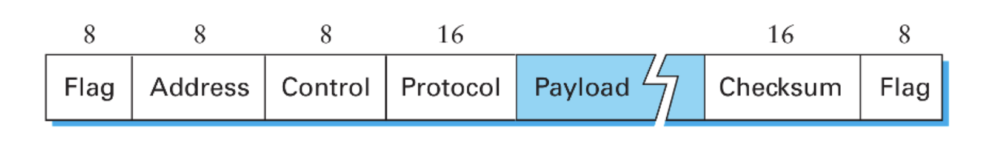

# Unidad 2 - Nivel de Enlace

Tanto OSI como TCP usan un modelo basado en *capas*. Cada Entidad separa su
funcionalidad en varias capas. Cada capa agrega info de control, mediante el
agregado de headers. De esta forma la capa agrega / interpreta los headers o
frames enviados / recibidos y permite que haya una comunicación entre las capas
adyacentes pero a su vez capa a capa entre los distintos hosts.

Además, el servicio que una capa le brinda a otra se puede clasificar en:

- **sin conexión y sin reconocimiento** (ej: UDP)
- **sin conexión y con reconocimiento** (ej: uso de ACK en capa 2 de OSI)
- **orientado a conexión** (ej: websockets, TCP)

El objetivo de los protocolos de comunicación (nivel de enlace en OSI), buscan en proveer:

- confiabilidad
- control de errores
- control de flujo

Un ejemplo para garantizar control de errores sería agregar un CRC / checksum
que el receptor valida. Si el receptor detecta que el mensaje es inválido,
basta con que no mande un ACK (aknowledge) de que recibió el mensaje.

## Control de errores

Si consideramos que lo que mandamos son *codewords* de \\(n\\) bits, compuestos
por \\(m\\) bits de datos y \\(r\\) bits de redundancia y siendo \\(d\\) la
distancia mínima de Hamming entre 2 codewords posibles y \\(e\\) la cantidad de
bits erroneos para un cierto mensjae, necesitamos que se cumpla que:

- \\(e + 1 \leq d\\) para poder detectar que hubo errores
- \\(2*e + 1 \leq d\\) para poder corregir errores

> Si quieren ver un algoritmo para detección y corrección de errores pueden
> chequear
> [Reed-Solomon](https://www.cs.cmu.edu/~guyb/realworld/reedsolomon/reed_solomon_codes.html)

## Confiabilidad

Para garantizar confiabilidad, va a ser necesario poder efectuar
*retransmisiones*. Esto se puede dar de forma **implícita** cuando se produce
un **timeout** (tiempo sin recibir un ACK de que se recibió el mensaje), o de
forma **explícita** si nuestro protocolo admite mensajes de control.

Cómo puedo hacer el ACK de cierto símbolo? Mediante números de secuencia. El
ACK entonces representa que el frame con cierto número de secuencia fue
recibido.

### Primer approach: Stop and Wait

- Espero a recibir el ACK para mandar el nuevo frame.
- Dado que es "bloqueante", basta con tener un único bit para el número de secuencia.

Qué pasa si ocurre lo siguiente:

1. El emisor manda el primer frame
2. Transcurre el tiempo suficiente para que ocurra un timeout (en el medio el
   Receptor recibe el frame pero no responde a tiempo)
3. El emisor vuelve a mandar el primer frame
4. El emisor recibe el ACK del primer frame
5. El receptor recibe el primer frame y manda el ACK
6. El emisor recibe por segunda vez el ACK del primer frame

Ese fenómeno es lo que se conoce como el **problema del solapamiento** o el
**problema de las reencarnaciones**, y los distintos approaches van a buscar
problemas de lidiar con esto.

### Eficiencia de un protocolo

Queremos evaluar cuánto tiempo se está transmitiendo vs cuánto tiempo se está
esperando por confirmaciones. Lo definimos como:

$$
\eta_{proto} = \frac{T_{tx}}{\text{RTT}(F)}
$$

> Pregunta: Tiene sentido que \\(\eta_{proto} > 1\\)?

### Segundo approach: Ventana deslizante

Para el caso de Stop and Wait, notar que transmito la mitad de lo que dura el
RTT y después espero, entonces tengo una eficiencia del 0,5. Queremos hacerlo
mejor.

Idea: mando varios frames seguidos, sin esperar al ACK. Esto es el concepto de
**ventana de frames**, y en ese caso el cálculo de la eficiencia cambia
ligeramente:

$$
\eta_{proto} = \frac{T_{tx}(V)}{\text{RTT}(F)}
$$

Ahora el \\(T_{tx}(V)\\) es el tiempo que me tarda mandar todos los frames de
la ventana, mientras que el \\(\text{RTT}(F)\\) es lo que tarda en volverme el
ACK del primer frame que mandé.

- Requiero de más bits para el número de secuencia (tiene que permitirme
  identificar todos los frames de la trama por lo menos)
- A medida que recibo los ACk voy desplazando la ventana (ojo porque ahora hay
  que determinar cuándo desplazo la ventana. Siempre que recibo? O sólo si
  recibí el siguiente al último que tenía reconocido?)

Para buscar la mejor eficiencia posible se define como tamaño de ventana (en
frames) a:

$$
\text{SWS} = \frac{V_{tx} * RTT}{|Frame|}
$$

Y envío un frame nuevo siempre que \\(\text{UltimoFrameEnviado} \leq \text{UltimoFrameReconocido} + \text{SWS}\\)

### ACKs acumulativos vs selectivos

En la sección anterior faltó mencionar cuál es el comportamiento esperado del
receptor ante algún error. El primer approach es el de ACKs acumulativos, en
donde a partir de que se produce un error en la transmisión el receptor ignora
todos los mensajes posteriores hasta que el frame con error se reenvía y recibe
correctamente. (Esta idea de retransmitir todo se lo conoce también como
**GoBackN**)

Ahora, también podría pedir que el receptor tenga un buffer que permita guardar
los frames que va recibiendo, y en ese caso basta con que el receptor mande una
señal pidiendo el frame específico.

Para ambos casos definimos la ventana de recepción \\(\text{RWS}\\) como:

$$
\text{RWS} = 
\begin{cases}
\text{SWS},  & \text{si hay SACK} \\\\
1, & \text{en caso contrario}
\end{cases}
$$

Además, como se puede dar acá también el problema de las reencarnaciones, es
necesario poder distinguir por lo menos \\(SWS + RWS\\) frames distintos.

### Sobre la eficiencia de la ventana

Primero necesito que definamos algunos conceptos:

- El **tiempo de transmisión** \\(T_{tx} = \frac{|datos|}{V_{tx}}\\) es el
  tiempo para enviar todos los bits de un frame a través del medio de
  transmisión.
    - Ocupa una porción significativa de tiempo en conexiones lentas o donde el
      frame es muy grande.
- El **tiempo de propagación** \\(T_{prop} = \frac{distancia}{V_{prop}}\\) es
  el tiempo desde que el bit es transmitido hasta que llega al receptor.
    - La velocidad de propagación \\(V_{prop}\\) es algo propio del medio de
      transmisión, por lo general cercano a la velocidad de la luz (suele ser
      una constante multiplicada por la velocidad de la luz).
    - Ocupa una porción significativa de tiempo en conexiones entre dos puntos
      muy lejanos.
- El **tiempo de encolamiento** \\(T_{queue}\\) es el tiempo que espera un
  frame en un buffer hasta ser transmitido. Dependiendo del estado de
  congestión de la red puede ser significativo o no.
- El **tiempo de procesamiento** \\(T_{proc}\\) es el tiempo que se tarda en
  leer el header de un frame y decidir qué hacer con él. En la práctica se lo
  asume nulo o poco significativo.

Por último, la **capacidad de volumen** \\(C_{vol}\\) de un canal sería la cantidad de bits
que entran en el canal desde que se envía el primer bit hasta que llega al
receptor (una suerte de flujo máximo de bits para quienes hayan cursado algo
III). 

$$
C_{vol} = \text{Delay} * V_{tx}
$$

Sin embargo, para los protocolos punto a punto se es un poco más
específico y se mide como la cantidad de bits que entran **hasta recibir el
primer ACK**

$$
C_{vol} = \text{RTT} * V_{tx}
$$

(Recuerdo: antes mencionamos que el tamaño óptimo de ventana era \\(SWS = \frac{\text{RTT} * V_{tx}}{|frame|} = \frac{C_{vol}}{|frame|}\\))

Entonces... ¿Por qué es óptimo?

Recordamos que la eficiencia del protocolo de ventana deslizante se medía como:

$$
\eta_{proto} = \frac{T_{tx}(V)}{\text{RTT}(F)}
$$

\\(T_{tx}(V)\\) Era el tiempo que tardaba en mandar todos los frames de la ventana. Eso lo podemos pensar como:

$$
T_{tx}(V) = \frac{SWS * |frame|}{V_{tx}}
$$

Entonces:

$$
\eta_{proto} = \frac{SWS * |frame|}{V_{tx} * \text{RTT}(F)} \\\\
SWS = \eta_{proto} * \frac{V_{tx} * \text{RTT}(F)}{|frame|}
$$

Y asumiendo que \\(\eta_{proto} = 1\\) dado que es óptimo obtenemos que:

$$
SWS = \frac{V_{tx} * \text{RTT}(F)}{|frame|}
$$

