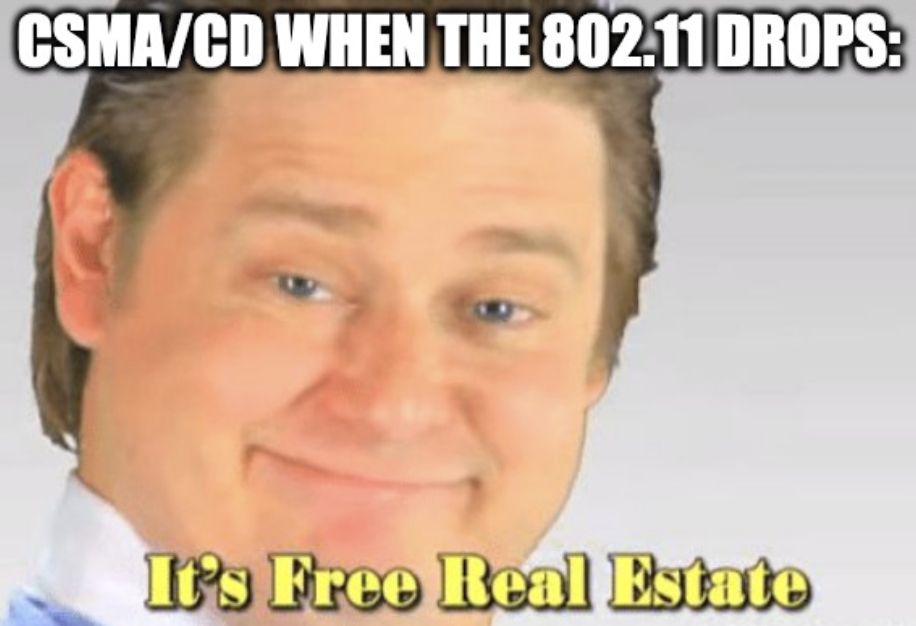
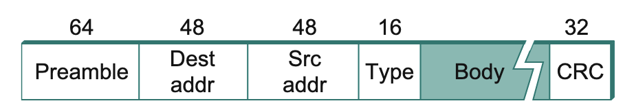
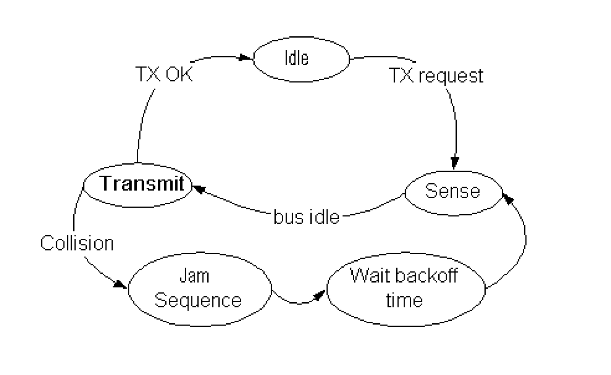
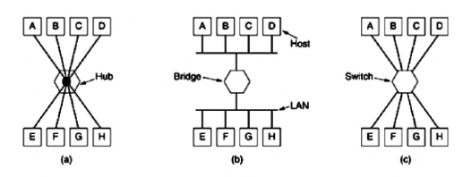

# Unidad 3 - Medios Compartidos

Antes vimos que se podía compartir un canal de transmisión mediante técnicas
como la multiplexación por tiempo o por frecuencia. Esas técnicas lo que
permitían era lograr que varios nodos utilicen el medio "de forma
independiente", o sea que la transmisión de un dispositivo no interfiera con la
de otro.

Ahora vamos a ver otro approach, que es sugerido y generalmente utilizado para
ethernet y en el protocolo de wifi (802.11). La idea es permitir que todos los
dispositivos usen el mismo canal para transferir, y si más adelante hay un
problema (ej 2 quieren transmitir al mismo tiempo) ahí se ve cómo se resuelve.

Y por supuesto se va a buscar minimizar la cantidad de intentos que tiene que
hacer un dispositivo para poder hacer el envio de paquetes deseado y asegurar
fairness.

La tecnología que usa Ethernet y otras redes inalámbricas (802.11), lleva el
nombre de Carrier Sense, Multiple Access with Collision Detect (CSMA/CD). Es un
protocolo que permite que un conjunto de nodos manden mensajes a través de un
enlace compartido.

- El **Carrier Sense** viene por el hecho de que todos los nodos pueden
  distinguir en todo momento si un canal está libre o en uso.
- Por otro lado, el **Collision Detect** viene por el hecho de que el emisor a
  medida que transmite sensa el canal y puede darse cuenta de si hubo una
  colisión en la transmisión con otro nodo.

La realidad es que hoy en día la mayoría de las conexiones cableadas son punto
a punto (o sea el enlace es propio de cada par de nodos). Y la parte de
multiplexación la resuelven los switches. Es por eso que hoy en día no está tan
presente el protocolo... redes cableadas.

Por otro lado las redes inalámbricas hoy en día son la norma en muchos entornos
con lo cual el uso de CSMA/CD retoma relevancia.



```admonish info title="Dominio de Colisión"

Llamamos **Dominio de Colisión** al conjunto de los nodos que pueden generar
una colisión en el medio al intentar transmitir (no están incluidas los nodos
separados por medio de un switch).

```

## CSMA/CD

Vamos a ver el caso de acceso múltiple en cable ethernet ya que si bien es algo
anecdótico hoy en día, los mismos principios se pueden aplicar a nuevas
tecnologías.

Para empezar hablemos un toque de Ethernet:

- Admite tramos de hasta 500m (no más para evitar atenuación de la señal).
- Admite máximo hasta 4 repetidores
- Requiere como mínimo 2,5 metros entre host y host.
- Las transmisiones son broadcasteadas a lo largo del cable (y a través de
  repetidores)

Además, un frame de Ethernet contiene los siguientes campos (segun el estándar 802.3):



- Primero tiene un preámbulo de 64 bits, es una secuencia de 0's y 1's
  alternada que le permite al receptor sincronizarse con la señal.
- Después le siguen las direcciones de destino y fuente respectivamente que son
  direcciones de 48 bits.
    - las direcciones son "únicas" y vienen grabadas en la rom de los
      adaptadores de red
    - El adaptador de red sensa el canal y si ve un frame cuyo campo de
      destinatario es su dirección entonces le deriva el frame al host. Hace lo
      mismo si el frame tiene la dirección de broadcast.
- Después sigue el campo del tipo, que indica a cuál protocolo de más alto
  nivel se le enviaría el frame.
- Luego el body del frame tiene la data en si a enviar. Un detalle no menor es
  que un frame puede contener hasta 1500 bytes de datos, y tiene que tener por
  lo menos 46 bytes de datos (esto último es necesario para tener tiempo
  suficiente de detectar una colisión) por lo que en caso de no tener
  suficientes datos se le agrega algo de padding.
- Por último un campo CRC para chequeo de errores

Un pequeño detalle es que para el host el frame de ethernet en realidad no
tiene ni el preámbulo ni el CRC, el adaptador de red es el que se encarga de
agregar esos campos extra.

El algoritmo que sigue un transmisor que implementa CSMA/CD se puede resumir con el siguiente diagrama de estados:



- El transmisor siempre que le llega un frame nuevo va a intentar transmitir
    - Si el canal está libre transmite de una
    - Si el canal está ocupado, espera a que se libere
        - Ni bien se libera, el transmisor va a intentar enviar
- Si está transmitiendo, pueden pasar 1 de 2 cosas:
    - Es el único dispositivo usando el canal y el frame se envía correctamente
      y sin problemas 
    - Mientras está enviando, otro dispositivo también decide enviar un frame,
      generando lo que se conoce como una **colisión**. Para eso el transmisor
      sensa el medio y si detecta un voltage anormal entonces eso es a causa de
      la colisión
        - Cuando detecta una colisión frena la transmisión actual y envía una
          **secuencia de jamming** de 32 bits (por lo general es una tira de
          1's y listo). El objetivo de dicha secuencia es hacer que el receptor
          deje de escuchar la señal.
            - Eventualmente el otro emisor también va a detectar la colisión y
              va a enviar su propia secuencia de jamming.
        - Una vez que se detecta la colisión y se envía la secuencia de
          jamming, se aplica una política de **exponential backoff**. Eso es
          esperar un cierto tiempo antes de enviar. Si se vuelve a dar una
          colisión, esperar el doble y así hasta que se haga efectiva o se
          supere un límite predefinido (en general es de 16 intentos), en cuyo
          caso el adaptador avisa al host que la transmisión falló.

```admonish info title="Exponential Backoff"

Para ser un poco más específico, la idea en el exponential backoff es dividir
el tiempo en slots entre 0 y \\(2^k - 1\\), siendo \\(k\\) la cantidad de
intentos. Se elige uno de los slots al azar y eso representa la cantidad de
slots que se espera. Un slot representa 51,2 \\(\mu\\)s que es el tiempo
necesario para transferir el frame más chico.

```

Ahora que conocemos el algoritmo, tiene más sentido el motivo por el cuál
necesitamos tener al menos 46 bytes de datos a enviar. Esto es porque incluso
en el caso en el que estén los dos hosts lo más alejados posible (2500 metros
usando 4 repetidores), el Round Trip Delay es de al rededor de 51,2 \\(\mu\\)s
que en una conexión de 10Mbps equivale a 512 bits. De esta forma, si nuestra
frame tiene al menos 512 bits si o si uno de los dos emisores va a detectar la
colisión antes de terminar de enviar su frame.

```admonish info title="Transmisores *p*-persistentes"

Ethernet se dice que es un protocolo 1-persistente porque siempre que sensa el
medio y está libre va a intentar enviar. Este es un caso particular de lo que
se conoce como transmisores *p*-persistentes, en donde se transmite con
probabilidad *p* una vez que se libera el medio.

```

Una última observación es que en este algoritmo se contempla que sólo se puede
leer *o* escribir en el canal, pero no los 2 al mismo tiempo. Eso se conoce
como un algoritmo de **half-duplex**. No confundir esto con la clasificación de
canales. El canal puede ser full duplex (se puede escuchar y enviar al mismo
tiempo) mientras que el algoritmo es half duplex.

Recomiendo también pegarle una chusmeada a [esta explicación](https://cs.newpaltz.edu/~easwarac/CCN/Week13/CSMA.pdf) de CSMA/CD.

### Midiendo performance de CSMA

Sean \\(S\\) la **carga ofrecida** (nro de intentos de transmisión por unidad
de tiempo, o sea cuánto tengo que usar del medio para transmitir) y \\(G\\) el
**goodput** (proporción de transmisiones exitosas por unidad de tiempo),
entonces:

$$
S = G * (1 - P_{colision})
$$

Podemos graficar la relación entre la carga, el goodput y la variante de CSMA:


- Aloha es otro protocolo que consiste en lo que vimos antes. Enviar un mensaje
  y si no me llega un ACK de dicho mensaje re-enviar. (esto no descarta
  totalmente ese mecanismo para asegurar confiabilidad y control de errores
  porque como verems más adelante si se usa en protocolos de más alto nivel)
    - Slotted aloha es lo mismo pero la emisión se da en "slots discretos"
- CSMA es fácil de implementar pero tiene mala perf en la práctica a medida que
  aumenta la carga. (en estudios se validó que a partir de 30% de carga aprox
  ya se degrada mucho)
- En el gráfico se hace mención de non-persistent CSMA. La diferencia entre
  este y 1p-CSMA/CD es que 1p-CSMA/CD transmite ni bien encuentra el canal
  libre. En cambio el non persistent sensa el canal y si está en uso espera una
  cantidad fija de tiempo (no transmite ni bien se libera). Si bien reduce las
  changes de colisión también cae el throughput. Dicho eso reacciona mejor a la
  relación entre carga y goodput.
- Se hace obvia la relación entre el delay hasta poder transmitir (si espero
  más entre cada transmisión) y el goodput, y cómo esto afecta al throughput
  final.

---

TODO: Resumir diapos 20-24 inclusive (no encuentro referencia en la docu)

---


## Redes Compartidas (Redes inalámbricas)

- En las redes inalámbricas, la señal disminuye / se atenúa con la distancia (mayor impacto que en no inalámbricas)
- Además las fuentes de ruido son más impredecibles
- Qué sería compartir el medio acá? Se comparte el ancho de banda (el espectro electromagnético).
- Está regulado con qué potencia se transmite
- El medio es mucho más fácilmente "pinchable" (es por eso que se vuelve una verdadera necesidad encriptar la data)

### Bandas no licenciadas

Son bandas para las cuales no tengo que pedir permiso para transmitir

- 900 mhz
- 2.4 ghz
- 5 ghz

Si alguien quiere transmitir en la misma frecuencia me va a generar
interferencia. Entonces surge la pregunta, si 2.4 es una banda no licenciada y
todo el mundo lo usa, cómo es que mi wifi no es interferido por el del vecino?
Eso es el motivo por el cual hay límites a la potencia de la señal.

Además, las bandas se pueden particionar en canales. Por ejemplo, para 2.4 en
wifi tengo la banda partida en 13 canales y sólo puedo usar 3 de esos canales:
el 1, 6 y 7 y cada uno tiene un ancho de 22mhz.

Para el caso de 5ghz, puedo tener canales de 20, 40, 80 y 160 mhz

Más adelante surgió la idea de usar el espectro expandido. La idea es saltar
entre frecuencias varias veces por segundo. Surgió en el contexto de
comunicaciones militares porque hacía más difícil detectar la señal y casi
imposible meterle ruido (el Tanembaum usa el término [jammed](https://youtu.be/FcArnepkhv0?si=oO4tNudSObUe5nF5&t=86)).

## Protocolos de acceso múltiple

Hay 2 problemas importantes que surgen en el uso del medio compartido para wireless:

- El **problema de la estación oculta**: si tengo la transmisión `A -> B     C`, `C` sensa el medio para transmitir y no detecta a `A` por estar fuera de alcance. Entonces empieza a transmitir, introduciendo ruido en lo que b detecta.
- El **problema de la estación expuesta**: si tengo las transmisiones `A <- B      C   D` y C quiere transmitir a `D`, puede que `C` sense el medio y como detecta la transmisión de `B` a `A` entonces decide no transmitir cuando en realidad la transmisión de `C` a `D` no afectaría la señal que `A` recibe.

Para paliar estos problemas tenemos una variante de CSMA que es **CSMA/CA** (o sea con **collision avoidance**).

### CSMA/CA

- Antes de transmitir, escucho
    - Si no está ocupado espera un tiempo llamado **espaciado entre tramas
      (IFS)**
    - Si está ocupado o se ocupa durante la espera hay que esperar hasta el
      final de la transacción
        - Cuando termina la transacción se ejecuta un algoritmo de backoff
            - se espera un valor de una uniforme en un intervalo llamado
              **ventana de contención**
                - se mide en slots
                - si durante ese tiempo el medio está ocupado durante un tiempo
                  mayor al IFS, se suspende la espera hasta que se cumpla la
                  condición de canal libre

En WiFi se espera recibir ACK a diferencia de ethernet. Si no se recibe se
retransmite a diferencia de ethernet. Si no se recibe se retransmite.

## Modelo de Referencia de 802.11 (WiFi)

Lo componen 3 subcapas de LLC:

- A nivel físico:
    - PMD (Physical Media Dependent)
        - Infrarrojos
        - FHSS
        - DSSS
        - OFDM (multiplexación por división de frecuencia ortogonal) + MU-MIMO
          (multi-user, multiple input, multiple output)
            - SU-MIMO (Single User) permite al AP comunicarse con un único
              dispositivo a la vez. Al dividir el ancho de banda en canales
              independientes permite conectarse con varios dispositivos a la
              vez.
            
        - Hoy ya existe OFDMA que es una variante que usa un único canal para
          transmitir todo pero ajusta en base al volumen de tráfico de cada
          canal.
    - PLCP (Physical Layer Convergence Procedure)
- A nivel enlace:
    - subcapa MAC:
        - Acceso al medio: CSMA/CA 
        - usa Ack
        - Fragmentación
        - Confidencialidad (opcional)

Wifi per se se implementó de forma half duplex (hacerlo full duplex aumentaría costos de fabricación)

### IEEE 802.11 MAC

Hasta la versión más sencilla de Wifi trabaja con las DCF (Función de
Coordinación distribuída o CSMA-CA). El período de contensión de CSMA-CA desde
el punto de vista estadístico nos da un acceso "equitativo al medio".

- Se minimiza la colisión entre tramas
- Mientras el canal está libre el nodo decrementa el backoff counter
    - si llega a 0 el nodo envía el frame
        - si no recibe ack (o sea asume que hubo un error/colisión en la transmisión), se elige una nueva ventana de contensión en un rango del doble del anterior.
        - se repite hasta que el canal esté libre para enviar

```admonish info title="Evolución WiFi"

En la siguiente tabla se puede ver la evolución del protocolo a lo largo del
tiempo:


Ojo, la velocidad es en bps (a nivel físico). Una estimación grosera es por
ejemplo para 802.11n de los 600Mbps, **en tu lan** vas a alcanzar unos 300Mbps.
El resto se lo llevan los headers del mismo protocolo entre otras cosas.

```

```admonish warning title="Ejercicio de final - Análisis de Performance"

- Tenemos una notebook que accede al servicio de banda ancha ADSL mediante un **AP 802.11ac**.
- El AP se conecta al Home Gateway
- El servicio ADSL tiene una velocidad de transmisión máxima de 1Gbps
- Queremos hacer una transferencia de un archivo de 10GB desde un servidor en USA a la notebook.

Cuánto estimamos que demora la transferencia?

1. Si hacen 10GB * 8 / 1Gbps... hay tabla. Hay que chequear más cosas.

- Un dato importante es que la notebook se conecta mediante un AP 802.11ac!
- La velocidad del servicio de banda ancha, a qué nivel está medido? (vamos a
  suponer que está medido a nivel IP)
- cuál es la velocidad de bajada y cuál es la de subida? (en gral la de subida
  es aprox. 1 a 20 veces la de bajada).
    - si es un 802.11n ya tengo a nivel enlace un cuello de botella de 390Mbps
    - si es un 802.11ac Wave 1 también es cuello de botella
    - También depende de qué soporte la notebook.
    - En el oral si no está especificado habría que preguntar
    - Hay que ver el RTT del servidor también
- otra cosa que puede pasar es que haya atenuación y obstáculos en el medio, y
  en esos casos el ap baja de 1024 QAM por ejemplo a un esquema de modulación
  más bajo, y por entre transmite a una velocidad más baja.

```

### Anomalía del Wifi

- WiFi da acceso equitativo al medio.
- Los nodos de más baja velocidad consumen más "tiempo de aire", y además al
  ser más rápidos los nodos más rápidos reciben menos tiempo de aire.
- en consecuencia los nodos con velocidad baja degradan la velocidad de los
  nodos de mayor velocidad.

## Data Link Layer Switching

Una **LAN** (Local Area Network) es una red privada que opera de forma cerrada.
Vimos además que en la infraestructura de red tenemos algo que nos conecta a la
red interna del proveedor de internet (DSLAM por ejemplo). Ahora, qué pasa
cuando tengo varias LANs y las quiero unir para que se comporten como una única
LAN.

Esto se puede lograr con dispositivos llamados **bridges**, hoy también
llamados switches. Notar que por ahora nos vamos a referir a los switches como
dispositivos de capa de enlace pero también hay switches que operan en la capa
de red. Al operar en capa de enlace, sólo les interesa forwardear los frames en
base a la dirección de destino. Cualquier protocolo montado sobre la capa de
enlace (sea IP, AppleTalk, u otros) van a ser soportados por un bridge, a
diferencia de lo que ocurre con los switches de la capa de red que sólo
soportan los protocolos para los que se los programó.

Algunos casos de uso:

- En la facu cada departamento tiene su propia LAN, pero además queremos tener
  una única red para todos los dispositivos de la facultad
- A veces queremos partir una LAN en muchas para distribuir la carga (si no
  floodeariamos toda la red por cada comunicación)
    - Esto también lograría particionar el dominio de colisión
    - cómo logramos esto? Bueno, los bridges sólo forwardean frames por los
      puertos que haga falta.

```admonish info title="Supongamos..."

Veamos lo que pasa bajo las siguientes 3 siguaciones:



- En a) tengo todos los hosts conectados a un mismo hub, por lo que todos
  comparten el mismo medio físico y puede haber colisiones (y tenemos que
  pensar en modelos de ack o un CSMA/CA)
- En b) Tengo la LAN separada en 2 de cada lado hay un dominio de colisión y
  por ende todavía pueden haber colisiones.
- En c) están todos los hosts conectados a un switch, por ende ahora la
  cuestión pasa por el mismo, que guarda en sus buffers los frames y va
  despachando. En este caso directamente desaparecen las potenciales
  colisiones, ACK, CSMA/CD y pasa a ser un problema algorítmico de cómo el
  switch maneja esos buffers y los dispatch.

```

Notar que para que estas cosas sean posibles, es necesario que funcionen de la
forma más transparente posible y sin mucha configuración adicional. Y los
dispositivos dentro de una LAN no deberían de enterarse que forman parte de una
LAN más grande a priori. Se usan dos algoritmos para bridges que nos proveen
dicha transparencia:

- Primero un algoritmo para "aprender" dónde no hace falta forwardear frames (o
  sea evitar generar tráfico innecesario).
- Y además un algoritmo (de AGM) que nos permite romper los ciclos dentro de la
  red (para que no queden frames zombies dando vueltas).

### Cómo operan los bridges / switches

Los bridges operan en modo promiscuo, lo que significa que acepta todos los
frames que llegan en cada uno de sus puertos y decide si forwardea o descarta
el frame y en caso de forwardearlo por cuál puerto. Para decidir eso último se
basa en la dirección de destino de la metadata del frame.

Una forma de implementar esto podría ser con una tabla de hash que mapea
`dirección destino -> puerto de salida`. Sin embargo la tabla inicia vacía, por
lo que se procede a usar un algoritmo de flooding. Cada frame que vaya a un
host que todavía no conocemos se forwardea al resto de los puertos, y una vez
que se conoce se deja de forwardear y se manda por el puerto correspondiente. Y
cómo me entero de qué puerto le corresponde a una dirección? Bueno, puedo ver
la dirección del host que envía el frame.

La topología de la red puede cambiar. Para manejar esos casos, lo que hacemos
es guardarnos la asociación `addr -> (port, timestamp)`. Cada vez que recibo un
frame y el host src está en la tabla de hash, actualizo el timestamp, y
periódicamente se limpian las entradas de la tabla que tengan más de un par de
minutos.

El algoritmo entonces se puede resumir a:

```rust
if not table.contains(frame.dstAddr) { forward_except_port(frame, frame.srcPort) } // Descarto el frame (srcPort en realidad no es parte del frame, es una simplificación)
else if frame.srcPort == table[frame.dstAddr] {  } // Descarto el frame
else { send(frame, table[frame.dstAddr]) } // Lo mando por el puerto que corresponde
```

#### Spanning Tree Bridges

Para mejorar la disponibilidad y tolerancia a fallos, es normal que hayan
enlaces redundantes, cosa de que si uno falla no se fragmente la red. Sin
embargo, este tipo de situaciones trae algunos problemas ya que introducimos
ciclos en la topología de la red. 

Por qué los ciclos son un problema? Porque si recordamos el algoritmo hace que
forwardiemos frames cuyos destinatorios no conocemos. Entonces el frame se
mueve permanentemente a lo largo del ciclo. Para solucionar esto, se establece
un protocolo para los mismos bridges que les permite mantener una idea de AGM
de la red. Y sí, nos vamos a olvidar de algunos enlaces para lograr esta
estructura acíclica.

Para construir dicho Árbol Generador Mínimo, los bridges corren un algoritmo
distribuido. El mismo consiste en:

- Cada bridge periódicamente broadcastea un mensaje de configuración a todos
  sus puertos
- También procesa los mensajes de configuración que reciben de sus vecinos.
  Estos mensajes no son forwardeados ya que no queremos caer en el problema de
  loops nuevamente.
- El primer paso es ponerse de acuerdo en qué nodo va a ser la raiz del AGM.
  Para eso incluyen en sus mensajes de configuración su MAC address junto al
  identificador del bridge que creen que es la raíz.
    - Eligen como raíz al de identificador más chico
- Una vez elegida la raíz, se construye un arbol de caminos mínimos desde la
  misma hasta cada otro bridge. Las distancias son la cantidad de saltos que se
  requieren para llegar de un nodo a otro. Los casos de empate se resuelven
  mirando el identificador.
    - Para encontrar los caminos mínimos, los bridges mantienen el camino
      mínimo que tienen hasta la raíz. Y "apagan" los puertos que no forman
      parte de ese camino (notar que el camino de cada puerto puede ser
      independiente de los otros).
- Una vez que el AGM se estabiliza, los bridges vuelven al modo de operación
  usual. Sin embargo el algoritmo se corre cada tanto para detectar cambios en
  la topología de la red y actualizar el árbol.

### VLANs

Las VLANs surgen como consecuencia de la necesidad de desacoplar la conexión
física de una posible conexión lógica (diferentes áreas en una empresa, por
ejemplo) y brindar mayor flexibilidad en el manejo de la red.

Usan Switches especiales que están al tanto de la existencia de las VLANs.

- Requieren que los bridges tengan una configuración de qué VLANs son
  accedibles por qué puerto. 
    - Dicha marca sirve como filtro en todo el algoritmo del bridge. O sea sólo
      forwardea y broadcastea por los puertos correspondientes a la vlan del
      frame recibido.

Para soportar esto se agregó a partir del estándar **802.1Q** un tag de VLAN al
header del frame ethernet. Una de las claves para llevar esto a la práctica es
que a priori los hosts no se enteran de la existencia de las VLANs, por lo que
puede ser info que se agrega una vez sale del host. De hecho el primer bridge
que sea VLAN-aware es el que agrega el campo y el último bridge lo saca.

- Todos los hosts de un puerto tienen que pertenecer a la misma VLAN
- El único cambio al header es el agregado de 2 bytes:
    - VLAN protocol ID (constante = `0x8100`)
    - Un byte compuesto por 3 fieldss:
        - un bit de prioridad (no relacionado a VLAN pero lo agregaron porque
          no pasa seguido que se cambia el protocolo). Sirve para identificar
          tráfico con requisito de real-time vs soft real-time.
        - un bit de CFI (canonical format indicator), servía para marcar si era
          big endian / little endian pero después se cambió (sth sth politics
          sth).
        - un VLAN Identifier de 12 bits (o sea el "color" de la VLAN al que
          pertenece el frame)
