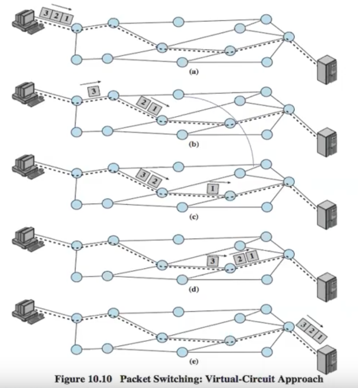
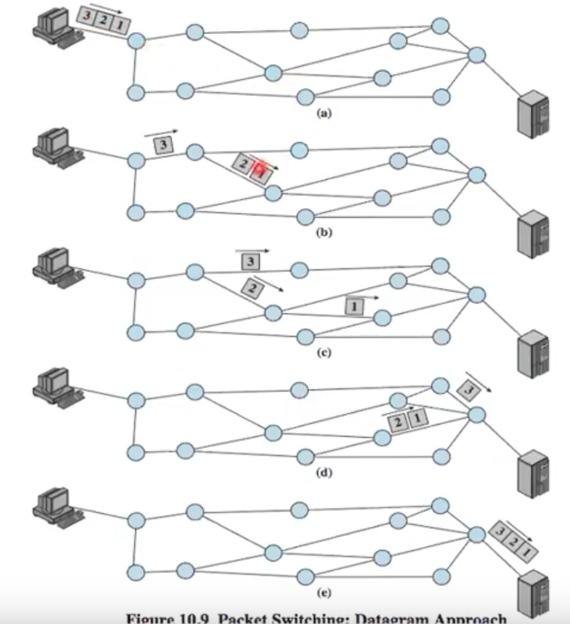
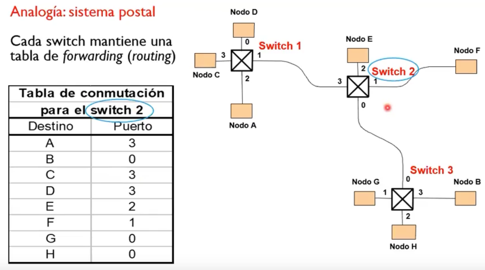
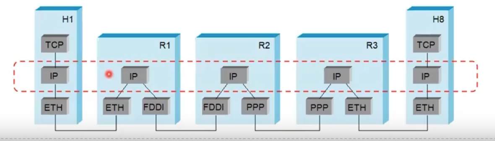
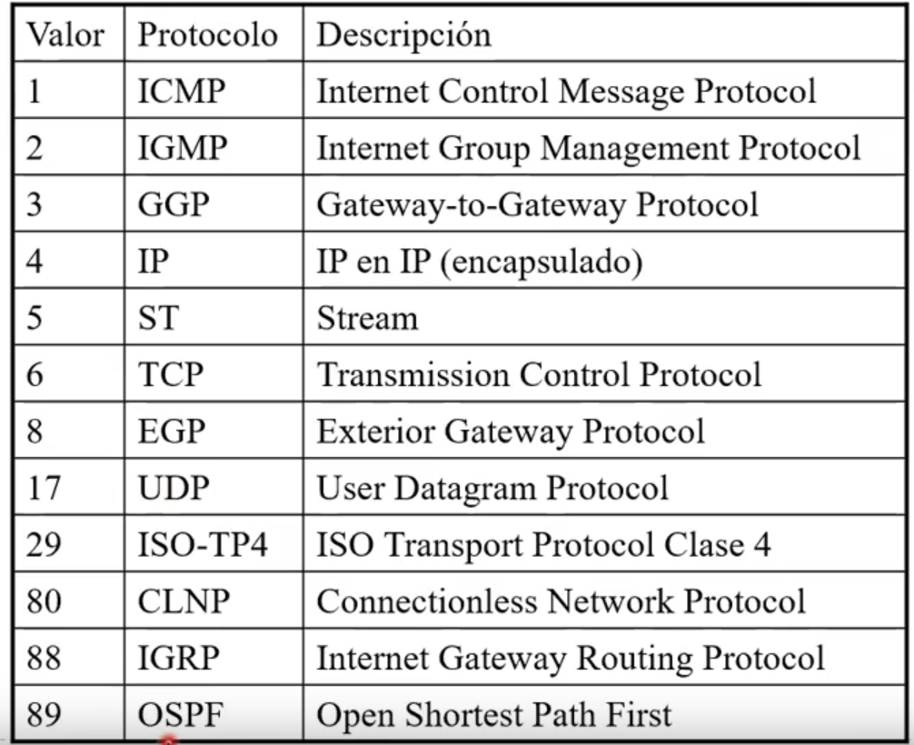

# Unidad 4 - Nivel de Red


Retomando el modelo OSI, podemos ver que de capa 3 para abajo tenemos lo que se
llama el **límite de subred de comunicación**, que delimita las capas sobre las
que operan los isp.

## Redes escalables... con switches

Peterson afirma que internet es una red **escalable**. Por escalable vamos a
entender como aquello que cuando crece, el costo de su
mantenimiento/administración es mínimo. Internet no solo es escalable, es
**altamente escalable**.

Cómo se logra eso? Principalmente mediante **routers/switches**. Su objetivo
principal es conmutar o forwardear paquetes. Dependiendo el tipo de switch, van
a distribuir paquetes mediante:

- **circuitos virtuales**
- **conmutación de datagramas**

Notar que ambos pertenecen al paradigma de conmutación de paquetes, pero
también existe lo que antes se usaba que era la conmutación de circuitos.

### Conmutación de paquetes

Tenemos 2 paradigmas (que usan una u otra forma de distribuir paquetes):

- Orientado a conexión (circuitos virtuales): acá también mando varios
  paquetes, pero el camino es fijo. 
    - necesito "alguna magia" que arme toda la ruta
    - le decimos "orientado a conexión" porque previamente establezco una
      comunicación entre ambos hosts.
    - tengo 3 fases:
        - establecer conexión
        - mandar datos
        - levantar la conexión
    - llegan en orden
- Sin conexión (datagramas IP): parto la info a mandar en datagramas (cachitos
  de info) y la mando, cada uno puede tomar una ruta a destino distinta y
  podrían llegar desordenados. 
    - **no existe una fase para establecer una conexión**
    - como cada paquete se envía de forma independiente, tiene que ser
      autosuficiente. O sea necesita dir fuente y dir destino (cof cof IP)
    

Si bien circuitos virtuales estaba medio muerto, con la tecnología 5G tuvo un
renacimiento, aunque se lo llama **slicing**

#### Conmutación sin conexión

- cada switch mantiene una tabla de forwarding
    - uso un **algoritmo de ruteo** para armarla
- la tabla me dice a dónde mandar un paquete en base a la dirección destino.
- tuvo que haber un algoritmo de seteo inicial para armar esas tablas



#### Conmutación orientada a conexión / Circuitos virtuales

- al igual que datagramas se arma una tabla pero una **tabla de circuitos
  virtuales** (no vamos a estudiar cómo). La misma tiene:
    - Puerto por donde llega un paquete
    - VCI (id del circuito) de entrada
    - puerto de salida del paquete
    - id del VCI de salida
- cómo armo la tabla de circuitos? cómo armo los VCI?
- cómo sé dónde está cada nodo?
- Tengo 2 tipos:
    - permanente (la define el administrador)
        - se tiene que configurar y recién ahí puedo proceder a mandar datos
    - por solicitud o conmutado
        - se mandan mensajes de solicitud de conexión a la red
        - se arma una cadena de switches que llevan hasta el host destino que
          tienen que aceptar la conexión y propagar la solicitud al siguiente
          switch / nodo.
        - una vez construido el circuito virtual se empiezan a enviar datos

Cuál sería algún incentivo para preferir circuitos virtuales? Al establecer la
conexión uno puede "reservar" recursos (léase ancho de banda, buffers, etc.)
puedo garantizar cierta calidad de servicio y mejor control de congestión.

#### Modelo de Datagrama vs Circuitos

Datagrama:

- No hace falta esperar a un RTT para establecer una conexión
- Inmediatamente disponible para mandar datos
- Envío paquete sin establecer conexión
- Estadísticamente los datagramas llegan en orden
- Hago mi mejor esfuerzo para rutear el paquete en la red

Circuitos Virtuales:

- Necesito fase inicial para establecer una conexión y una final para
  liberarla, que no transportan datos del usuario
    - tengo algo de overhead
- Una vez establecido el circuito se usa siempre eso para mandar (no es adaptable a fallas/congestión)

Ahora, una vez establecida la conexión los circuitos virtuales funcionan mucho
mejor. Por qué entonces ganó datagramas.

- Circuitos virtuales requería más infraestructura del lado del ISP
    - Eso también permitía ser más exigentes con el costo del servicio (ej: te
      cobro por cada paquete transmitido)
    - Al ser más complejo es también menos escalable
- Si bien con datagramas la comunicación es "boba", eventualmente se armaron
  protocolos que permiten resolver algunos de los problemas que circuitos
  virtuales resolvía mediante infra, pero con software (esa solución es la que
  conocemos como TCP).

```admonish warn title="Conmutación de circuitos vs. Conmutación de paquetes"

Algo en lo que se hizo mucho incapié es en el hecho de que podemos llegar a
confundir circuitos virtuales con conmutación de circuitos, y que por ende
ambos operan en capas 1, 2 y 3. Sin embargo, recordemos que conmutación de
circuitos refiere a lo visto para la unidad 0 y aplica únicamente a capa 1
(física).

```

### IP en Internet

- Permito interconexión de redes
- A priori puedo tener distintos tipos de conexiones a lo largo del camino que
  toma el paquete, pero el "glue code" viene a ser ip: 
- IP **ES SENCILLO**
    - El formato fundamentalmente es agregar dos campos, hay más cosas pero el
      core son los campos de dirección fuente y destino

### Campos del header IP (versión 4)

- Header de 20bytes con 40 bytes extra para campos opcionales
- Los campos
    - *Versión*: para tener versiones coexistiendo
    - *Longitud del header*: ya que puede crecer por los opcionales
    - *DiffServ/ECN*: permite dar prioridad a cierto tráfico (ej: puedo
      configurar los routers de mi red para que prioricen al ECN específico)
    - *Longitud total*: en bytes e incluyendo el header
    - *Fragmentación*: Ta compuesto por varios sub-campos: Identificación, bit
      de No fragmentar (DF), bit de más fragmentar (MF) y un bit de
      desplazamiento.
        - No todas las tecnologías de acceso al medio tiene el mismo tamaño de
          trama. Entonces IP necesita un mecanismo de fragmentación para pasar
          por distintos tipos de redes con distintas tecnologías de acceso al
          medio.
    - *TTL*: es un contador que se decrementa con cada salto entre routers. Si
      llega a 0 se descarta el paquete.
    - *Checksum*: sólo del header, no de los datos (TCP es el único que hace
      correción de errores)
    - *Dirección fuente y destino*: de 32 bits
    - *Protocolo*: un identificador que le permite al router saber qué lleva el paquete IP
    

#### Fragmentación y re-ensamblado

- Cada tecnología de acceso al medio tiene (a nivel de enlace), un **MTU**
  (Maximum Transmission Unit)
    - ej: en Ethernet son 1500 bytes, en FDDI 4500 bytes
- Entonces, IP se adapta a la tecnología de enlace
    - Si recibo un datagrama y MTU < |Datagrama|, lo tengo que partir en
      fragmentos o **fragmentar** y el host destino los **reensabla**
    - Los fragmentos llevan un identificador cosa de saber cuáles corresponden
      a un mismo datagrama
    - Además contienen:
        - un offset para poder ordenarlos
        - un bit para marcar el último fragmento
- Hoy en día, estadísticamente, la fragmentación es mínima (si tenés mucha
  fragmentación puede que te estén hackeando).

### Direccionamiento Global

- Se pensó una organización **jerárquica**
    - Una dirección compuesta por red + host
- Las direcciones son "globalmente únicas"
- Esquema de clases *A*, *B* y *C*
    - las clases más altas pueden tener más hosts

### Forwarding de IP

Cómo hacen los routers para saber a dónde mandar un datagrama?

- El datagrama recordemos tiene la dirección destino
- Si el router está en dicha dirección destino, entonces hace el forward al
  host
- Si no está conectado directamente a esa red, tiene que hacer un forward a
  otro router que lo elige en base a su **tabla de forwarding**
  - mapea una dirección de red al *next hop*
- Además cada host tiene un default router

### IPV6

- Se definió en la década del 90'.
- El número de dispositivos totales que soportaba IPv4 admitía ~4300 millones de direcciones.
- En su momento no se pensaba que ibamos a quedarnos sin direcciones pero hoy en día ya es una realidad.
- Usa 128 bits de direccionamiento en lugar de sólo 32 bits
