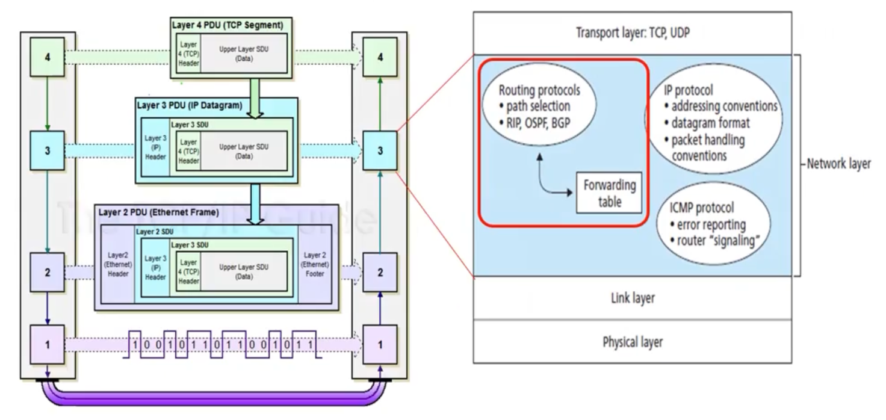
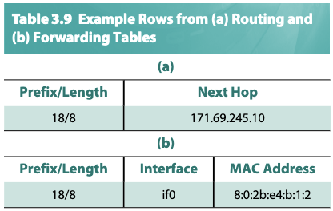
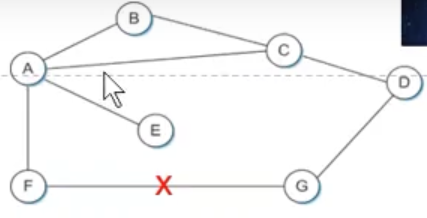
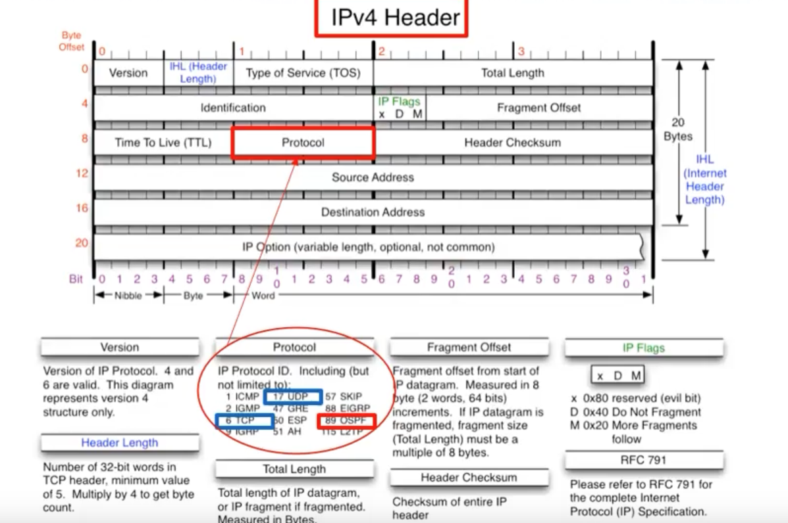
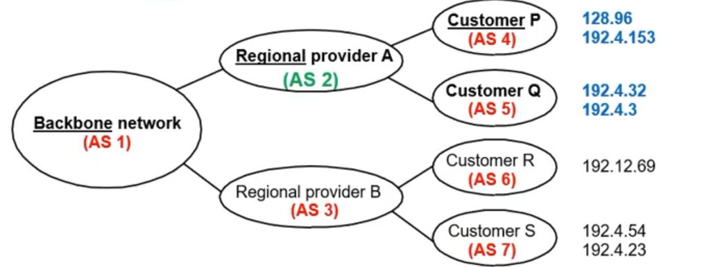

# Unidad 5 - Ruteo

## Internetworking

En el 74' publican un paper de lo que se iba a a convertir en el protocolo
TCP/IP. Sin embargo, a este le faltaba una parte fundamental de lo que es hoy
en día que es el **ruteo**.

### Sistemas autónomos

Uno podría decir que internet es la interconexión entre **sistemas autónomos**, que
los definimos como un conjunto de routers administrados por la misma entidad.
Por ejemplo, la red de algún ministerio, la de la facultad, la de tu trabajo,
etc.

- Tengo 2 tipos de ruteo:
    - interno(IGP): lo que se mueve dentro del sistema autónomo
    - externo(EGP): lo que va hacia otro sistema autónomo
        - hoy en día el protocolo estandarizado para esto es **BGP** (Border
          Gateway Protocol)
- A priori lo que pasa adentro de un sistema autónomo queda dentro del sistema
  autónomo. Los otros sistemas autónomos no conocen esos detalles.
    - Dicho eso, hay 2 protocolos dentro de los más usados
        - **RIP**
        - **OSPF**

Nosotros vamos a priorizar protocolos de ruteo interno. De ruteo externo más
que nada hablamos de las políticas.

```admonish info title="Analizando la red"

Si pensamos en la internet como la interconexión de sistemas autónomos, podemos también querer analizar el grafo subyacente de esas interconexiones. Pero esa no es la única forma de analizarlo. Podemos armar:

- grafo de routers
- grafo de Web servers
- grafo de Name servers
- grafo P2P
- grafo CDN
- etc.

```

### Ruteo

En última instancia, nuestro problema se reduce a poder mandar los
paquetes/frames de una punta a la otra. Tenemos 2 procesos:

- Forwarding (esto es similar a lo que vimos con los learning bridges) consiste
  en **elegir una puerta de salida** mirando la dirección destino y tablas de
  ruteo.
- Ruteo: este es el proceso por el que **construimos las tablas de ruteo**
    - Es un problema de grafos
    - Vemos a la red como un conjunto de nodos y arcos pesados

Además hay 2 tipos de ruteo:

- Estático: lo configuro una vez y listo
- Dinámico: se configura autónomamente y se adapta a cambios en la topología de
  la red.

```admonish info title="Ruteo en modelo OSI"

- Llamamos **PDU** (Protocol Data Unit)
    - A nivel 4 es un segmento
    - A nivel 3 es un datagrama
    - A nivel 2 es un frame
    - el PDU es la unidad de datos relevante para cada capa. Esto contiene no
      sólo la data que viene de la capa superior/inferior, si no también el
      encapsulado hecho por la capa
- Al nivel 3 lo conforman un par de protocolos:
    - Protocolos de ruteo
        - permite elegir caminos para los datagramas
    - Protocolo de IP
        - describe las convenciones de direccionamiento, el formato de los
          datagramas y las convenciones sobre el manejo de paquetes
    - Protocolo ICMP
        - permite reporte de errores, mandar señales entre routers entre otras
          cosas
        - por ejemplo, las aplicacioneas *ping* y *traceroute* están basadas en
          el envío de paquetes ICMP. Ping manda un mensaje de *ICMP echo
          request* y cuando le llega al destino responde. Se repite varias
          veces y se sacan métricas. Traceroute arranca con TLL = 0 y envía el
          echo request y va aumentando el TTL de a 1, entonces cada request va
          encontrando un hop nuevo cada vez.
        - [offtopic](https://www.cloudflare.com/en-gb/learning/ddos/glossary/internet-control-message-protocol-icmp/):
          explicación breve de cloudfare sobre qué es el protocolo ICMP y
          algunos ataques conocidos 



```

### Tablas de Ruteo y de forwarding

- La tabla de enrutamiento dice a qué "next hop" mandar el paquete (tiene la
  info lógica)
    - además como next hop puedo tener un default gateway (por ejemplo, en gral
      el router de nuestra casa sigue la regla de que todo lo que no esté
      dentro de la red sale al default gateway)
    - si el dstAddr pertenece a la misma red que el router entonces ya puede
      mandar el paquete por la interface correspondiente a esa red.
- La tabla de forwarding dice cómo mandar el paquete a un next hop (tiene la
  info física)
    - cómo se le asigna inicialmente una ip si recién me conecto? DHCP (lo
      vemos más adelante), que te provee de una IP privada para la red local.
- el mapeo de dirección IP -> dirección física se conoce mediante ARP
  (Adress Resolution Protocol)

#### ARP



- Cada router mantiene una tabla (ARP table o ARP cache)
  que mappea addrIP -> addrFísica
- Aprox. cada 15 minutos se reinicia dicha tabla
- Algoritmo: si al momento de mandar no tiene el mapeo
  IP -> MAC entonces broadcastea un ARP query. La query
  tiene la dirección IP. El host que recibe la query y
  matchea su dirección ip con la de la query, manda una
  respuesta que contiene la MAC.
- También en el ARP query se incluye la dirección del
  que emite la request lo cual hace que todos los otros
  hosts y routers que lo reciban ya conozcan la
  dirección física que le corresponde a la IP que hizo
  la query.
- Al igual que pasaba con las tablas de los learning
  bridges, si ya estaba en la tabla se resetea el tiempo
  límite para sacar la row de dicha tabla.

#### DHCP

- Es un método de configuración dinámica para asignar IPs a los distintos nodos
  de una red.
- El detalle principal es la existencia de al menos un servidor DHCP.
    - el servidor mantiene una pool de direcciones disponibles que va a ir
      administrando de forma automática.
- Además, dado que la idea es minimizar la cantidad de configuración a realizar
  también se provee un mecanismo para que los hosts encuentren y se puedan
  comunicar con el servidor DHCP.
    - Envían un mensaje *DHCPDISCOVER* a la dirección de ip de broadcast
    - El servidor DHCP eventualmente recibe el paquete y responde
- Además, no siempre contamos con un servidor DHCP por red (ni siempre es
  deseable), por lo que también se cuenta con *relay agents* que su función es
  mantener la dirección IP del servidor DHCP. El relay agent se encarga de
  mandarle al servidor DHCP los mensajes *DHCPDISCOVER* que recibe.
- El protocolo también admite la posibilidad de que la ip se otorgue por un
  tiempo determinado. Esto permite olvidarnos de detectar nodos caídos o que se
  desconectan y facilitan el manejo y la liberación de recursos para el
  servidor.
    - Los hosts tienen la posibilidad de "renovar" dichas direcciones IP

### Algoritmos de ruteo interno

Se clasifican en:

- **Distance vector**
- **Link state**

Y estos dan lugar a los protocolos de ruteo (RIP y OSPF)

| Cada Router    | DISTANCE-VECTOR    | LINK-STATE    |
|---------------- | --------------- | --------------- |
| Qué informa?    | Toda su tabla de ruteo    | Sólo el estado de sus enlaces directos    |
| A quién le pasa la info?    | Sólo a sus vecinos    | A toda la red (hace flooding)    |
| Algoritmo utilizado    | Bellman-Ford distribuido    | Dijkstra    |
| Datos utilizados    | Info de sus vecinos    | Estado de enlaces de cada nodo    |
| Estructuras de datos    | Tabla de distancias y Tabla de ruteo    | Tabla de Estado de Enlaces y tabla de ruteo    |
| Características    | Ciclos de Ruteo    | Visión consistente de la red    |
|     | Gran variedad de algoritmos(Merlin-Segall, Jaffe-Moss, entre otros.)    | Algoritmo básico único    |
|     | Cálculo distribuido    | Cálculo centralizado    |
|     |     | Mucho uso de CPU y Memoria    |
| Protocolo de Internet    | RIP    | OSPF    |

```admonish info title="Pequeño recuerdo de Bellman-Ford vs Dijstra"

Ambos algoritmos permiten construir un arbol de caminos mínimos con raíz en un
nodo *v*

#### Bellman-Ford

Idea: construyo un arbol de caminos mínimos parcial \\(T_k\\) donde
\\(T_k[i]\\) te dice la distancia del camino mínimo del nodo \\(i\\) a la raiz
\\(v\\) usando a lo sumo \\(k-1\\) ejes, y cuál es su antecesor en ese camino.
Eventualmente el \\(T_{|V|-1}\\) tiene lo que quiero.

#### Dijkstra

Idea: es el algoritmo de prim de AGM pero cambiamos la función que se usa para
definir qué nodo agregar y con qué arista. Elijo aquél nodo cuya distancia a la
raíz se minimice con la arista agregada. O sea si tengo el subárbol generador
\\(T_k\\) enraizado en \\(v\\), agregamos el nodo \\(w\\) y la arista \\((u,w)\\) 
que minimizan \\(T_k[u] + d(u, w)\\) para cada arista candidata.

```

### RIP (Vector de Distancia)

- Cada nodo mantiene una tabla de distancias con tuplas de `(Dst, Cost,
  NextHop)`
    - Tiene la mejor distancia conocida a cada destino, y qué salida se usa
      para llegar ahí
- Intercambia mensajes **sólo con los vecinos directos**
    - Esto ocurre periódicamente (cada ciertos segundos) o cuando su tabla
      cambia por algún trigger.
- Cada actualización es una lista de pares `(Destination, Cost)`
- Se modifica la tabla si se recibe una **mejor ruta**
    - Tiene menor costo
    - Llegó desde el next-hop de ese destino
- Al igual que antes, tienen un timeout bajo el cuál se limpian las entradas de la tabla
- Por qué se eligió Bellman-Ford distribuido en lugar de Dijkstra? Porque como
  mencionamos, dijkstra consumía más cpu y memoria y al principio no había
  tanto hardware que lo soporte (o se volvía muy caro).

Algoritmo:

```python
def receive_table(self, router_id, routing_table):
    for (destination, cost, next_hop) in self.routing_table:
        if destination == self.router_id: continue

        if routing_table[destination] + self.routing_table[router_id] < cost:
            self.routing_table[destination] = (routing_table[destination] + self.routing_table[router_id], router_id)
```

En gral el costo lo medimos en nro. de saltos y listo. Al principio que tengo
nodos a los que no sé cómo llegar, los inicializo en infinito.

#### Qué pasa cuando un enlace falla?

- caso feliz
    - falla el enlace de F a G. F lo detecta y setea su distancia a G a
      infinito, y avisa a sus vecinos.
    - A se entera de eso y también setea su distancia a infinito.
    - A recibe una actualización de C con un camino a G en 2 saltos. Actualiza
      su tabla para tener distancia de 3 saltos a G y manda la info a los
      vecinos.
    - F recibe la actualización y setea su distancia a G en 4 saltos usando A.
      
- caso triste (inestable, **conteo a infinito**)
    - falla el enlace de A a E. A le comunica a B y a C una distancia infinito
      a E.
    - Tanto B como C antes de recibir el update de A comunican que llegan a E con distancia 2
    - Luego se les actualiza su distancia a infinito
    - Luego B decide que llega en 3 saltos a E a través de C y le avisa a A
    - A decide que llega en 4 saltos a E a través de B y le avisa a C
    - C decide que llega en 5 saltos a E a través de A
    - B decide que llega en 6 saltos a E a través de C
    - y así sucesivamente...
    - Esto está muy condicionado al timing en el que se reciben los mensajes.

Cómo lo resuelvo? Facilito: uso la heurística de que costo > 16 lo setea como infinito

#### Formato del paquete

- Comando
- Version
- Y una lista una atraz de la otra que contienen
    - red
    - tags
    - prefijo de red
    - mascara de red
    - distancia a la red


```admonish info title="Sobre qué capa corre RIP?"

Uno podría pensar que RIP corre encapsulado sobre capa 3. Sin embargo, su
implementación es a nivel de aplicación y corre como un daemon usando UDP. Las
tablas de ruteo siguen en capa 3 pero el algoritmo y armado de las tablas
corren como una aplicación más.


```

### OSPF - Open Shortest Path First (Link State)

- Todos los nodos tienen la misma info
    - O sea todos conocen la topología de la red gracias al mecanismo de
      flooding (el flooding se hace dentro del sistema autónomo)
- Calculo el camino mínimo usando Dijkstra (forward search)
- Algoritmo:
    - Descubro vecinos y sus direcciones de red
    - Mido el costo para cada vecino
    - Construyo un paquete con lo aprendido de los vecinos (Link State Packet,
      **LSP**)
        - ID del router que lo creó
        - Costo del enlace a cada uno de sus vecinos
        - Número de secuencia (SEQNO)
        - TTL
    - Mando el paquete a **todos los demás routers**
    - Aplica Dijkstra y calcula la ruta más corta a todos los nodos
- Flooding: Cada router
    - Almacena el LSP más reciente de cada nodo 
    - Decremena TTL
        - Descarta si TTL = 0
        - Manda un LSP ACK (por eso la inundación es confiable)
            - El protocolo reenvía los LSP que recibió a todos los que no le
              mandaron el ACK (y tampoco el que le había mandado el paquete)
    - Reenvía LSP a todos los nodos menos el que envió el paquete recién
      recibido
    - Genera LSP periodicamente e incrementa el SEQNO
    - Cuando se reinicia setea `SEQNO = 0`
- En la práctica el algoritmo se maneja on the fly
    - Los registos son `(dstAddr, cost, next_hop)`
    - Para eso se manejan dos listas:
        - tentativo
        - confirmado
        - En cada ciclo agrego entradas a la lista de tentativos, y el de menor
          costo de todos los tentativos se pasa a confirmado. Una vez agregado
          se recomputan los de la lista de tentativos.
- A diferencia de RIP, OSPF está implementado sobre IP directamente.

#### OSPF Jerárquico

- Puedo dividir un sistema autónomo definiendo
    - varias "áreas" (pueden tener routers adentro)
    - un troncal de routers (un backbone)
    - routers de frontera de área que conectan el área con los troncales
    - un router frontera que sale hacia otro sistema autónomo
- El flooding se hace dentro de cada área, entonces saturo menos la red con
  mensajes y hago más escalable a OSPF respecto de RIP

#### Mensajes de OSPF

| Tipo de Mensaje   | Descripción    |
|--------------- | --------------- |
| Hello   | Sirve para descubrir los vecinos   |
| Link State Update   | Proporciona los costos del emisor a sus vecinos   |
| Link State ACK   | Confirma la recepción del update   |
| Database description   | Anuncia qué actualizaciones tiene el emisor   |
| Link state request   | Solicita información del socio   |

```admonish warning title="PREGUNTA DE FINAL ALERT"

Por qué decimos que OSPF realiza una inundación **confiable**?

- Porque el flooding se hace a todos los nodos del sistema autónomo
- Y de cada nodo recibo el ack para asegurarme de que le llegó

```

#### Paquete de OSPF



Estoy mandando un paquete IP con el mismo formato que vimos en la unidad
anterior, en donde el campo de protocolo lleva el valor 89 para indicar que es
un paquete de OSPF. Además se usan algunos de los campos opcionales.

### BGP - Ruteo Interdominio

Generalidades:

- Diseñado para una red estructurada como árbol.
- Prioriza **alcanzar nodos**, no optimiza rutas.

Y para lograrlo usa los mensajes:

- Adequisición de vecinos: Pide a un router vecino ser su par, y los routers pares intercambian información de alcance.
- Alcance de vecinos: mediante mensajes de *HELLO* y *ACK* chequean periódicamente que sus vecinos sigan siendo alcanzables.
- Actualización de rutas: los routers intercambian periódicamente sus tablas de
  ruteo.

BGP resuelve el problema de evitar que los sistemas autónomos tengan que compartir info de alcanzabilidad entre ellos, manteniendo:

- cuáles rangos de direcciones IP se alcanzan en cada AS
- por qué ruta se puede llegar de un AS *A* a un AS *B*



En este ejemplo podemos suponer que cada regional provider es un proveedor
(léase telecom, telefónica, etc.). Para llegar a USA, cómo hace Telecom? Va a
tener que pasar por el backbone, supongamos que es At&t, que es un proveedor de
tier 1. Entonces, ese proveedor de tier 1 te va a cobrar por el servicio (que
sería publicar las rutas al resto del mundo, y además por cuánta data pasás).

Ahora, originalmente (~año 2000) el tráfico de acá se tenía que ir hasta USA
para volver a los servidores de acá. Se puede evitar eso? Surgen los NAP
(Network Access Point) o IX (Internet eXchanges).

- En Argentina tenemos la CABASE (Cámara Argentina de Internet)
- Tienen uno o varios routers gigantes que interconectan varios ISPs locales.
- 2 beneficios, menos RTT y menor costo para el tráfico internacional

Hoy en día, el tráfico internacional es bastante bajo porque el contenido está
almacenado localmente bajo CDNs (Content Distribution Networks).

