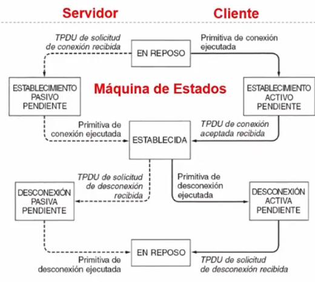
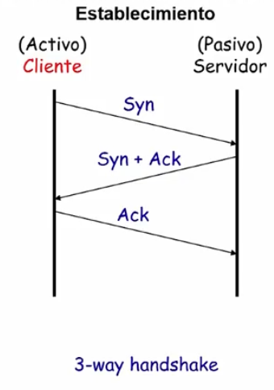
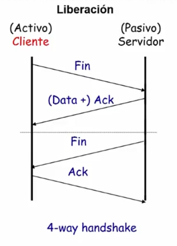
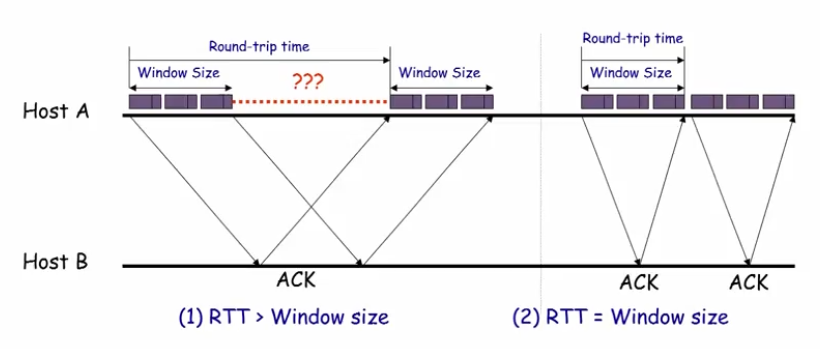

# Unidad 6 - Nivel de Transporte

- Llegamos a los primeros protocolos end-to-end, del nivel de transporte en
  OSI.
- El PDU en este nivel es el **segmento**.
- A diferencia del nivel de enlace, el nivel de transporte no puede tener
  conocimiento del delay (a priori).
- Además tiene que lidiar con la congestión de la red
- El modelo OSI normalmente piensa en el nivel de transporte como un modelo de
  cliente-servidor.
    - Lo representamos con una máquina de estados (el diagrama en realidad es
      el de TP4 pero está basado en TCP) 
- TP4 es un protocolo basado en conexión
- Ojo igual, no todos los protocolos son basados en conexión. Por ejemplo, UDP
  es un servicio sin conexión y por lo tanto no tiene necesidad de mantener
  toda esta máquina de estados.

## Protocolos end-to-end en subredes de datagramas

- Los servicios de la capa de red son best-effort
    - se descartan mensajes,
    - pueden llegar desordenados
    - pueden haber duplicados
    - los mensajes tienen tamaño limitado
    - no hay un límite de tiempo para entregar mensajes
- Es por esto en parte que los protocolos end-to-end intentan proveer algunos
  de los siguientes servicios:
    - garantía de entrega de mensajes
    - persistencia del orden 
    - entrega de a lo sumo una copia de cada mensaje
    - soporte para mensajes arbitrariamente largos
    - soporte de sincronización (para los servicios con conexión)
    - permitir al receptor controlar el flujo de datos del transmisor
    - soportar varias aplicaciones al mismo tiempo en un mismo receptor

## TCP

Idea:

- 2 Procesos: Cliente y Servidor
- Uno escribe bytes en un puerto/socket
- Hay un software tcp que tiene un buffer que almacena segmentos
- Y se van mandando esos segmentos por la red (TCP entiende de segmentos pero
  la aplicación **manda y recibe bytes**)
- Full duplex (en ambos sentidos)
    - Tengo control de flujo: para que el Tx no inunde al Rx (ej: mandar
      mensajes de "buffer lleno" para no overflowearlo)
    - Tengo control de congestión: para que el Tx no sobrecargue a la red

Algunas características:

- Orientado a conexión
    - Manejo de la conexión
        - 3 way handshake para establecer la conexión
        - 2-2 o 4-way handshake para la liberación de la conexión
    - Provee un servicio de flujo de bytes (stream-of-bytes)
- Es **confiable** ya que tengo:
    - ACKs
    - Checksums
    - Números de secuencia para detectar datos perdidos / desordenados
    - Timeout para retransmitir datos
    - Se pueden reordenar los datos desordenados
    - Implementa **Control de flujo** para no inundar al receptor

### MMS: "Maximum Segment Size"

El segmento de tcp consiste de un header de al menos 20 bytes y la data que
está limitada al MMS (Maximum Segment Size, 536 bytes por default). Otra vez
podemos apreciar que el segmento tcp va a encapsularse en un paquete IP que a
su vez se encapsula en uno o más frames de ethernet.


### Formato del segmento


- Tengo puerto destino y fuente
- Tengo campo de datos
- Tengo nro. de secuencia
- Nro de ACK
- Flags
- Aviso de ventana
- Longitud del Header
- Checksum
    - se calcula de forma "extraña": toma la data del segmento TCP + la
      dirección fuente y destino de IP (se aplica a nivel 4 y toma algún dato
      de la capa 3 también)
- Campos opcionales
- Un par más

Algunos detalles:

- los puertos son de 16 bits
    - las aplicaciones escuchan sobre algún puerto
- nro de secuencia de 32 bits. Identifica **el primer byte de datos**
- nro de ACK también de 32 bits. Identifica **el siguiente byte que espera el
  receptor**
    - implica que llegó ese y todos los anteriores
- la longitud del header es de 4 bits y se mide en cantidad de palabras de 32
  bits (necesitamos el campo porque hay campos de longitud variable).
- El aviso de ventana indica cuántos bytes pueden ser enviados a partir del
  último byte reconocido, permite evitar overflow en el buffer del receptor.

### Conexión TCP

- Cada conexión se identifica con una 4-tupla `(srcPort, srcIPAddr, dstPort,
  dstIPAddr)`
- Usa un mecanismo de ventana deslizante + Control de Flujo
    - Mando con seqNum
    - hago el ack con seqNum + advertisedWindow
- Hay 5 flags: `SYN`, `FIN`, `RESET`, `PUSH`, `URG`, `ACK`
    - `ACK = 1` se usa para marcar que estoy acknowledgeando algo (no se usa
      para el setup y teardown de la conexión, si no mas bien para la recepción
      de los datos)
    - `RST` se usa para reiniciar una conexión
    - `SYN` se usa para establecer la conexión, tanto para solicitar la
      conexión como para avisar que fue aceptado el pedido.
    - `FIN` se usa para liberar la conexión (especifica que el emisor no va a transmitir más datos).

Establecimiento de conexión:



Por qué hago el último ACK e incurrir en ese overhead? Para "resolver" [el problema de los generales bizantinos](https://stackoverflow.com/questions/36352236/two-general-agreement-and-tcp-handshake)

Liberación:



Acá hago lo mismo para "asegurarme" que ambos liberaron sus recursos.


### TCP: Ventana Deslizante


- Para el receptor es todo igual salvo por el hecho de que el tamaño de la
  ventana lo decide él mismo en base al espacio que le queda en su buffer
- Y tanto para el emisor como el receptor tienen que atajarse al caso de
  paquetes desordenados
    - El emisor mantiene 3 punteros: `LastByteAcked`, `LastByteSent` y `LastByteWritten`
        - A la derecha de `LastByteSent` tengo bytes generados pero no enviados
    - El receptor mantiene `LastByteRead` (por la aplicación), `NextByteExpected`, `LastByteRcvd`. Entre `NextByteExpected` y  `LastByteRcvd` pueden haber baches.
        - La aplicación sólo puede leer un byte si todos los anteriores fueron recibido
        - `AdvertisedWindow = MaxRcvBuffer - (LastByteRcvd - NextByteRead)`


### TCP: Retransmisión Adaptativa

```admonish warning title="Tema de Final ALERT"
```

Cuando trabajabamos con la capa 2, podíamos calcular el timeout de
retransmisión porque asumíamos varias cosas (ej: distancia acotada). Pero acá,
puedo saber eso? A priori no. Porque no conozco el delay.

En 1988 Jacobson propone un mecanismo de control de congestión bajo el título
de *A fast algorithm for rtt mean and variation*.

Idea: 

- Defino un timeout de retransmisión **adaptativo**, eso quiere decir que varía
  en función del estado de la red (esta idea está basada en los conceptos de
  **lazo cerrado y teoría de control**)
- En capa 2 la función de densidad del RTT de ACK tiene poca varianza mientras
  que en TCP tiene mucha.
- Algoritmo original:
    - Mide `SampleRTTi` para cada par segmento / ACK
    - Calcula el promedio ponderado de RTT `EstimatedRTT_i+1 = alpha *
      EstimatedRTT_i + beta * SampleRTT_i+1`
        - alpha + beta = 1
        - alpha entre 0.8 y 0.9
        - beta entre 0.1 y 0.2
        - es un blend entre el RTT estimado y el sampleado
    - Luego, `TimeOut =  2 * EstimatedRTT`
- Pregunta: por qué me tomo todo este trabajo y no hago `TimeOut = SampleRTT_i-1`
    - porque no queda estable
        - es preferible algo suavizado para no ser suceptible a cambios muy
          bruscos en la red.
- Variante algoritmo de Karn/Partridge [KP87]
    - Problema: en realidad son 2:
        - Tengo que retransmitir, y calculo el RTT en base a la transmisión
          original vs cuando me llega el ack en la retransmisión
        - Se cumple el Timeout, se re-envía e inmediatamente después llega el
          ACK. El SampleRTT queda chico.
    - Heurística: cuando hay retransmisión ignoro el RTT, si hay retransmisión
      no lo estimo y duplico el último timeout conocido.
- Variante bis de Jacobson / Karels: usan un cálculo que considere la varianza
    - `Diff = SampleRTT_i - EstRTT_i+1`
    - `EstRTT_i+1 = EstRTT_i + (delta * Diff)`
    - `Dev = Dev + sigma * (|Diff| - Dev)`
        - Sigma es un factor entre 0 y 1
    - `Timeout = mu * EstRTT + phi * Dev`
        - donde `mu = 1` y `phi = 4`
    - Timeout se acerca a `EstRTT` o a `Dev` dependiendo del valor dinámico de la varianza


### TCP - Sliding Window

En capa 2 buscamos que el window size sea tal que estoy enviando durante todo
el RTT. Pero acá puede no pasar, y esto limita el throughput:



`MaxThroughput = WindowSize / RTT`

TLDR: quiero siempre el "caño" lleno.

Ahora supongamos que tengo un `AdvertisedWindow` de 16 bits (o sea puedo mandar
hasta 64KB). Pero si tengo alguna tecnología razonable, el delay multiplicado
por el ancho de banda me va dando más y por ende se me hace cada vez más grande
ese espacio desaprovechado. 

Para esto tengo un campo en las opciones del header que determina que el aviso
de ventana es en KBs en lugar de bytes.

## UDP - Servicio Sin conexión

- Tiene un header simple:
    - Puerto origen
    - Puerto destino
    - Longitud UDP
    - Checksum UDP (únicamente del header)
- El número de puerto de origen permite la **multiplexación de procesos**
    - nro de puerto + dirección IP = Socket
    - Notar que esto también ocurre en TCP, pero no es una feature muy
      destacable para ese protocolo.
- En general, se monta RTP (Real Time Protocol) sobre UDP 
    - Pero Netflix Opera corre sobre TCP via HTTP

## Miscelaneous

```admonish info title="Something Something Quic"
Hace poco (2021) salió el standard para Quic, creado por Google que intenta ser un sucesor de TCP implementado sobre UDP:

<iframe width="560" height="315" src="https://www.youtube.com/embed/0B00TQ14faw?si=gy8gov_4CRVSvYAs&amp;start=609" title="YouTube video player" frameborder="0" allow="accelerometer; autoplay; clipboard-write; encrypted-media; gyroscope; picture-in-picture; web-share" allowfullscreen></iframe>
```
