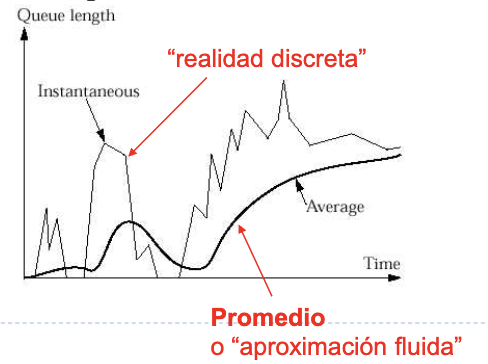
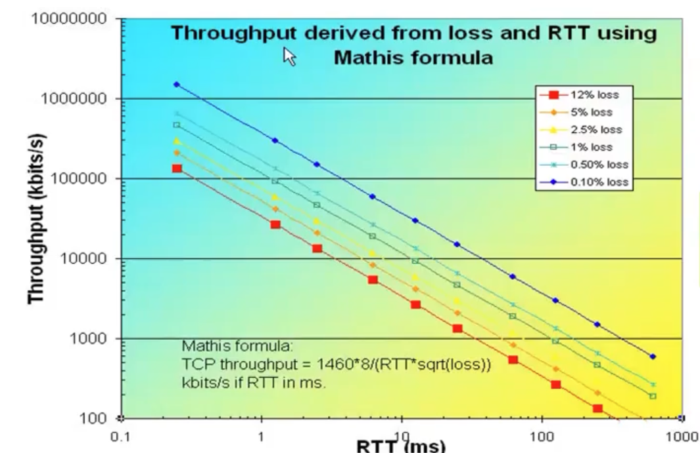

# Unidad 7 - El problema de Congestión

```admonish info title="But why tho?"

Inicialmente, Internet no tenía control de congestión. En el 84' ya se había
identificado la congestión como un potencial problema, sin embargo no fue hasta
el 86' que ocurrió un evento de congestión masivo por el cual la velocidad bajó
de 42kbps a 40bps, una reducción del 1000%!

```

Pensemos a nivel red hogareña, en donde tenemos varios dispositivos conectados
a la misma red, y todos salen por el mismo gateway (o router). Todos esos
dispositivos están constantemente compitiendo por recursos, un ejemplo sería el
buffer. Esto es lo que llamamos **multiplexación estadística** (es una
obviedad, pero no es únicamente el buffer de casa el que nos interesa. Esa
misma situación se puede dar en cualquier otro router).

- Cuando el buffer se llena, el router empieza a droppear paquetes
- La congestión de todos modos es algo inevitable y nuestro mejor objetivo es
  el de **controlarlo**, no eliminarlo.
- Por qué no mejor evitarlo? Puedo conseguir routers con mayor buffer y listo.
  El problema de eso es que a partir de cierto punto deja de ser rentable,
  porque capaz en promedio no tenés mucha carga y el problema es que cada tanto
  tenés picos de tráfico. Algo similar aplica a las autopistas, no las hago más
  grandes porque sale caro y no es rentable.

## Administración de buffers

- El Tanembaum hace referencia a congestión como algo global (que no es algo de
  un punto) de la red
- Pero nosotros consideramos tanto lo puntual como lo global. Tiene sentido
  considerar lo puntual:


- Si el buffer se llena => aumenta el delay
- Un buffer más grande puede llenarse más. Pero tengo que considerar que puede
  aumentar el tiempo de procesamiento (aunque evito perder paquetes).

**Definición**: la **congestión** es un estado de sobrecarga sostenida en la cual:

- Tengo al límite la disponibilidad de enlaces o de buffers
- Es observable porque se degrada el QoS

### Soluciones?

- Sobredimensiono
- Diseño cuidadosamente
- Hago un control proactivo para evitar la congestión

La solución es una suma de estas tres. En particular con el control proactivo
nos referimos a **decrementar la carga**. Quién decrementa la carga? Un
mecanismo de TCP llamado *control de congestión*.

## Análisis de Congestión

*Teoría de colas*: disciplina matemática que explica el funcionamiento de las
colas y a problemas relacionados.

### Sistema M/M/1 

Es un sistema cola-servidor (el servidor es el que se encarga de ir procesando
los paquetes encolados), en el cual el número de llegadas de paquetes es
markoviano (es un proceso de Poisson) y el tiempo de servicio (o sea el tiempo
que toma procesar un paquete) también es un Markoviano (en este caso un proceso
Exponencial) y donde asumimos que la cola tiene capacidad infinita. Llamamos
\\(\lambda\\) a la tasa de entrada y \\(\mu\\) a la tasa de servicio.


Dado el tipo de esas variables aleatorias sabemos que \\(\frac{1}{\lambda}\\)
es el tiempo medio entre llegadas y \\(\frac{1}{\mu}\\) el tiempo medio de
servicio. Y definimos \\(\rho = \frac{\lambda}{\mu}\\) a la **intensidad del
sistema** Siempre que \\(\rho > 1\\) el sistema eventualmente se desborda, o
sea que hay congestión (es razonable ya que no llegamos a atender a tiempo los
pedidos).

Usando una representación de Markov, se puede llegar a que \\(E(N)\\), la
esperanza de la ocupación del buffer y \\(E(T)\\), el tiempo de espera en el
sistema hasta ser procesado son:

$$
E(N) = \lambda * E(T) \\\\
E(T) = \frac{1}{\mu - \lambda}
$$

Y si pongo n servidores? A mayor cantidad de servidores mejora el tiempo de
respuesta (lo cual era razonable desde un principio). Sin embargo siempre tenés
una carga suficiente como para saturarte el sistema:


## Fundamentos

Distintas definiciones de congestión:

- Tanembaum: 
    > Too many packets present in (a part of) the network causes packet delay
    > and loss that degrades performance. This situation is called congestion
- Peterson (habría que especificar a qué nos referimos con QoS, en gral. se
  firman SLAs):
    > Demasiadas fuentes usando una red compartida, enviando demasiados datos
    > demasiado rápido como para ofrecer una buena calidad de servicio.

- Síntomas típicos:
    - pérdida de paquetes
    - retardo creciente

```admonish warning tile="OJO"

Control de congestion y control de flujo **son dos problemas muy diferentes**

TCP define una ventana efectiva que es un resultado de ponderar la ventana de
control de flujo (el aviso de ventana) y el control de congestion.

- Control de flujo maneja una comunicación punto a punto
- Control de congestión es algo que modifica toda una subred

```

- Asumimos algunas cosas
    - Las colas son de tipo FIFO
    - Se descartan paquetes cuando se llena la capacidad como política de
      manejo de buffers
    - simplificación: Si no llega ACK de TCP entonces hay congestión
        - Los libros hablan de que hay otras métricas (ej: % de paquetes
          descartados, average packet delay) pero en la práctica no se tienen
          en cuenta

### Políticas que influyen en la congestión por capa

Notar que no sólo capa 4 influye si no que las anteriores también.

| Capa   | Políticas    |
|--------------- | --------------- |
| Transporte   | Política de retransmisión   |
|    | Política de almacenamiento en caché de paquetes fuera de orden   |
|    | Política de ACKs   |
|    | Política de control de flujo   |
|    | Determinación de terminaciones de temporizador   |
| Red   | Circuitos virtuales vs. datagramas en la subred   |
|    | Política de encolamiento y servicio de paquetes   |
|    | Política de descarte de paquetes   |
|    | Algoritmo de enrutamiento   |
|    | Administración de tiempo de vida del paquete   |
| Enlace   | Política de retransmisiones   |
|    | Política de almacenamiento en caché de paquetes fuera de orden   |
|    | Política de ACKs   |
|    | Política de control de flujo   |

## Control de Congestión

Consideramos como control de congestión a todo lo que hacen los nodos de la red
para prevenir o responder a sobrecargas de la red.

Mediante 3 métodologías:

- Pre-asignando recursos (a.k.a subutilizo)
    - ej: designo buffer específico para gaming, buffer especídixo para streaming, etc.
- Libero recursos
- Controlo congestión sólo si ocurre (y cuando ocurre)
    - Tengo que decidir a quién "perjudicar"
    - Objetivo: permitir uso de recursos de forma "equitativa" (cuando hay congestión, todos se joden y fue)

## Criterios de Evaluación

- La idea es que la red sea usada de forma **eficiente** pero también **equitativa**
- Un buen indicador para la eficiencia: `potencia = throughput / delay`
- Indicador de equidad de Jain: dados \\(n\\) flujos por un enlace con throughputs \\((x_1, x_2, \dots, x_n)\\):

$$
\frac{1}{n} \leq f \leq 1 \\\\
f(x_1, \dots, x_n) = \frac{(\sum_{i = 1}^n{x_i})^2}{n * \sum_{i = 1}^n{x_i^2}}
$$

- \\(f = 1\\) es cuando hay equidad máxima

## Teoría de control

Un **sistema de lazo cerrado** es un sistema donde tomo una muestra de una
variable y en base a eso hago una acción.

- Ej: el aire acondicionado mide temperatura y en base a eso sigue o se apaga
- En TCP el timeout de retransmisión lo calculábamos en base al RTT estimado,
  que lo vemos como un sistema de lazo cerrado.

Dentro de los sistemas de lazo cerrado, los podemos clasificar según el tipo de
retroalimentación:

- **retroalimentación implícita**: que es lo que ocurre en TCP
    - la fuente infiere la congestión basado en Time-Outs, ACK duplicados
- **retroalimentación explícita**: que es lo que ocurre en ICMP
    - packet marking
    - problema: necesito cooperación explícita entre fuentes y componentes de
      red (switches). También debería cambiar los algoritmos de la fuente y los
      nodos.
    - Hoy está volviendo a resurgir la idea de revivir los bits de CE
      (Congestion Experienced) y ECN (ECN Capable Transport)

## RED (Random Early Detection)

- Propuesto por Jacobson
- Método implícito de Congestion Avoidance
- La idea es hacer una administración activa de la cola
    - Está pensado para trabajar en colaboración com mecanismos de control de
      congestión de la capa de transporte (en nuestro caso TCP)
    - En lugar de esperar a que se llene el buffer, cada tanto descarta un
      paquete con cierta probabilidad, una vez superado un threshold de carga

    

- Algoritmo:
    - Calculo largo promedio de la cola: `AvgLen = (1 - Weight) * AvgLen + Weight * sampleLen`
    - `Weight` es un escalar entre 0 y 1
    - `SampleLen` es el tamaño de la cola, que se actualiza con cada paquete
      que entra/sale
    - De alguna forma, `AvgLen` es una versión suavizada de `SampleLen`. Se
      puede observar con el gráfico: 
    - Cuando llega un paquete evalúo el `AvgLen` y:
        - Si estoy por debajo de `MinThreshHold`, encolo siempre
        - Si estoy entre `MinThreshHold` y `MaxThreshHold`, descarto con una
          probabilidad `p`
        - Si estoy por arriba del `MaxThreshHold`, descarto siempre
        - esa probabilidad `p` se calcula como:
            - `TempP = MaxP * (AvgLen - MinThreshHold) / (MaxThreshHold - MinThreshHold)`
            - `P = TempP / (1 - count * TempP)` con `count` el número de paquetes encolados
        - si graficamos la probabilidad de droppear en función del valor de `AvgLen`:
        

## Impacto del CC en TCP

- Vimos que RED está pensado para trabajar con el protocolo de transporte (en
  este caso TCP).
- Idea: defino una ventana de congestión
    - cuando pierdo un paquete, achico la ventana de congestión
    - genero una ventana efectiva de transmisión combinando la ventana de
      congestión y el advertisedWindow. Entonces al achicar la ventana de
      congestión, achico la ventana de transmisión (a costo de la Vtx).
        > Recuerdo: `Throughput = SWS * |frame| / RTT`
    - Regulo la ventana de congestión: la seteo en 1 y va creciendo de forma exponencial (slow start)

### Slow Start

Por cada RTT hago:

- Si recibo un ACK: `W <- (W+1)/ W`. 
- Si se pierde un ACK: `W <- W / 2`


#### Performance de TCP

- Asumo que tengo un flujo TCP
- Tengo RTT constante
- Tengo prob p de pérdida de paquetes
- Tengo un ancho de banda relativamente grande (lo que nos importa es que es lo
  suficientemente grande como para llenar el buffer)
- La señal de congestión es periódica

Me pregunto: cuál es el throughput de la conexión TCP

- Cuántos paquetes por ciclo?
- Cuál es la duración de un ciclo?

Fórmula final:

$$
BW = \frac{MSS * C}{RTT * \sqrt{p}} \\\\
C = \sqrt{\frac{3}{2}}
$$



- la escala es doble logarítmica
- \\(MSS\\) es el tamaño máximo de segmento (puede estár acotado por el MTU del
  enlace de salida desde el host), no incluye los headers de TCP e IP.
- conclusión: TCP está limitado por el RTT

## Moralejas

- La congestión es un fenómeno que siempre aparece.
- TCP implementa control de congestión e2e.
- lo vemos como un sistema de control de lazo cerrado con retroalimentación
  implícita.
- control de congestión en TCP: defino ventana de congestión que junto con el
  aviso de ventana defino una ventana de transmisión. Esa ventana al perder un
  paquete decremento y al recibir un ACK incremento.
- el control de congestión hace que el throughput sea constantemente variable.
- Qué hace por ejemplo Netflix cuando hay congestión y baja el throughput?
    - baja la calidad de la imagen ([Dash](https://en.wikipedia.org/wiki/Dynamic_Adaptive_Streaming_over_HTTP))
    - usa CDNs para bajar el RTT y aumentar el throughput
