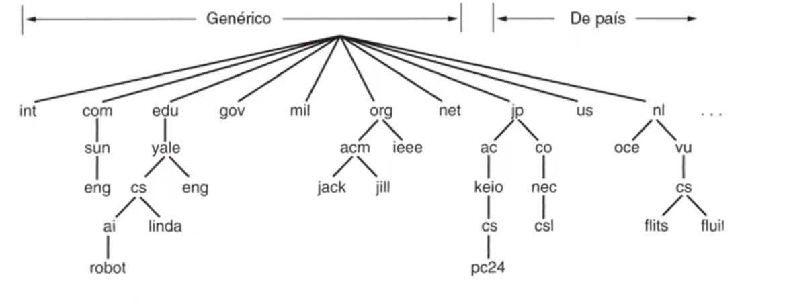

# Unidad 8 - Nivel de Aplicación

Estimación (inchequeable): alrededor del 80% de los protocolos de la capa de
aplicación están basados en el esquema cliente-servidor.

Acá vamos a hablar de DNS, SMTP, POP3, IMAP, HTTP. Pero en orden cronológico sería:

1. SMTP
2. DNS
3. HTTP (acá más o menos estarían POP3 e IMAP)

- **Visión**: en general tenemos una parte de comunicación + procesos
  distribuidos.
- Los protocolos de la capa de aplicación definen los mensajes que se
  intercambian los las apps.
    - Uso de acciones ejecutadas por procesos en los hosts
    - Uso de servicios de comunicación
    - Usan el servicio de capas inferiores (en particular para transporte TCP y
      UDP)
- Ojo: 2 procesos en un mismo host usan IPC (Inter Process), mientras que 2
  procesos en distintos hosts usan protocolos de la capa de aplicación.

### Características de los protocolos de la capa de aplicación

- En gral. son mensajes de petición y respuesta que se intercambian
- Por lo general definidos en los RFC (Request For Comment)
- Estructura de Cliente Servidor, el cliente inicia la comunicación y asume que
  hay toda una infraestructura que lleva lo que envía a través de su socket
  hasta la salida del socket del servidor.
- Se impulsa normalizar APIs de comunicación
    - facilita intercambiar una implementación por otra
    - reduce costos

### Servicios de los protocolos de transporte (Repaso)

TCP:

- orientado a conexión
- transporte fiable
- control de flujo
- control de congestión
- No proporciona: temporización

UDP:

- sin conexión
- fin de la lista(?)

### Criterio para elegir el servicio de transporte

- Pérdida de datos
    - algunas aplicaciones toleran pérdidas (ej: llamada de audio).
    - oOtras como la transferencia de archivos requieren transferencia
      confiable>
- Temporización
    - Algunas aplicaciones (como Telefonía en internet o juegos) requieren un
      delay artificial para eliminar el jitter.
- Ancho de banda
    - Algunas aplicaciones requieren un ancho de banda mínimo (ej: streaming de video)
    - Mientras que otras hacen uso del ancho de banda que tengan disponible (ej: cliente de email)

### Algunas aplicaciones de internet

| Aplicación    | Protocolo de capa de aplicación    | Protocolo de transporte subyacente    |
|---------------- | --------------- | --------------- |
| Correo electrónico    | SMTP (RFC 2821)    | TCP    |
| Acceso a terminales remotos    | Telnet (RFC 854)    | TCP    |
| Web    | HTTP (RFC 2616)    | TCP    |
| Transferencia de archivos    | FTP (RFC 959)    | TCP    |
| Streaming multimedia    | HTTP (Youtube, Netflix)    | TCP o UDP    |
| Telefonía internet    | SIP (RFC 3261), RTP (RFC 3550)    | UDP en gral, a veces TCP    |

## DNS (Domain Name System)

- aplicación que organiza máquinas dentro de dominios
- permite resolver un nombre de dominio en una dirección ip
- sistema distribuido escalable
- antes vos tenías un archivo de texto que tenía `<nombre_del_dominio>
  <dirección IP>`. 
    - De hecho sigue existiendo, es el de `/etc/hosts`
    - Esto obviamente a la larga deja de escalar porque tengo miles y miles de
      hosts
- definido en RFCs 1034/1035
- Tengo un *resolver* (que corre dentro del host) que recibe como parámetro el
  nombre del host a buscar.
    - El *resolver* envía un paquete UDP a un servidor DNS local, que busca el
      nombre y devuelve la dirección de IP al resolver y eventualmente se lo
      devuelve al solicitante.
    - Hay un admin que maneja el servidor de DNS
- El namespace está **organizado** en dominios de nivel superior
    - por país (jp, us, nl)
    - genéricos (com, gov, org)
    - En argentina tenés NIC.ar que administra todos los subdominios que están
      bajo el dominio ar
        - a los servidores de DNS que sirven estos nombres de dominio los
          llamamos **autoritativos**
        - de .ar cuelga .uba 
    - normalmente los DNS se dividen en zonas (que no se solapan)
        - cada zona tiene un nameserver primario
            - y algunos servidores secundarios que traen la data del primario,
              con motivos de redundancia y distribución de carga.

### Formato del archivo DNS

- Tengo una dupla `(Nombre, TTL, Clase, Tipo, Valor)`
- El registro de tipo SOA indica el nombre de la fuente de info primaria de la
  zona de cobertura del servidor.

| Tipo    | Significado    | Valor    |
|---------------- | --------------- | --------------- |
| SOA    | Inicio de autoridad    | Parámetros de la zona    |
| A    | Dirección IP de un host    | Entero de 32 bits    |
| MX    | Intercambio de correo    | Prioridad, dominio dispuesto a aceptar correo electrónico    |
| NS    | Servidor de nombres (Name Server)    | Nombre de un servidor para este dominio    |
| CNAME    | Nombre canónico    | Nombre de dominio    |
| PTR    | puntero    | Alias de una dirección IP    |
| HINFO    | Descripción del host    | CPU y SO en ASCII    |
| TXT    | Texto    | Texto ASCII no interpretado    |

### Tipos de consulta

El cliente hace una única consulta **recursiva** al Name Server local, el cual
si no conoce la respuesta hará una o múltiples consultas iterativas a los
distintos name servers. Notar cómo se procesa "de derecha a izquierda" cada uno
de los dominios + subdominios:

Algo muy usual para los servidores locales guardan cachean las respuestas.

Otro detalle es que separamos las respuestas **autoritativas** de las **no
autoritativas**. Las primeras son aquellas generadas por los servidores
responsables de la zona, que mantienen ciertas garantías de confiabilidad sobre
la respuesta.

## Correo electrónico

Tengo 2 componentes principales:

- Los Agentes de usuario (User Agent): el lector de correo, que interactúa con
  su servidor correspondiente para el envío y recepción de mails. Se conecta
  con los servidores por medio de **POP3** (Post Office Protocol) o **IMAP**
- Los servidores de correo: tienen
    - un buzón de correo para almacenar los mensajes
    - una cola de mensajes para la salida de los mensajes
    - el protocolo SMTP se usa entre servidores de correo para intercambiar los
      mensajes de correo electrónico

### SMTP

- Está montado sobre TCP
- Usa DNS para resolver nombres de dominios de los emails
- Interacción basada en "pregunta (comandos) y respuesta (código de respuesta)"

- Hereda en parte el formato de texto del mensaje del RFC 822 en el que se
  define:
    - Header
        - Para
        - De
        - Asunto
        - Cc
        - Bcc
        - Received
        - Return-Path (puede usarse para identificar una ruta de regreso al
          remitente)
        - Date
        - Reply-To: Dirección de correo a la que deben enviarse las
          contestaciones
        - Message-ID
        - In-Reply-To: Id del mensaje que se responde
        - References
        - Keywords
        - Subject
    - Body
        - el "mensaje" en caracteres ascii
    
### MIME, o cómo agregar gifs de gatitos al mail

- Objetivo: Quiero transmitir texto no plano (archivos binarios) por SMTP
- MIME: Extensiones de correo multimedia
- RFC 2045, 2056
- Antes de esto, si querían mandar fotos por mail tenían que encodearlas a base
  64 y ahí mandarlo como ascii, y después desencodear.
    - MIME automatiza este proceso agregando un par de lineas al header

Formato:

Header
    - MIME-Version
    - Content-Description
    - Content-Id
    - Content-Transfer-Encoding: cómo se encodeó el mensaje para transmitir
    - Content-Type: naturaleza del mensaje (ej: `Content-Type: video/mpeg`, el
      tipo y subtipo se separa con una barra)

Hoy en día hay muchos `Content-Type`:

### POP3 vs. IMAP

TLDR:

- POP3 almacena en la pc del usuario mientras que imap en el servidor (puedo leer offline, pero necesito mejor equipo y además no necesito mucho tiempo de conexión ya que tengo todo descargado de antemano)
- POP3 usa el puerto TCP 110 mientras que IMAP el 143
- POP3 está definido en el RFC 1939 e IMAP en el RFC 2060
- hoy en día es más común IMAP

## HTTP

- Una página web tiene objetos (un archivo HTML,  una imagen JPEG, un archivo de audio, etc.)
- Además una página web tiene un archivo HTML base que incluye objetos referenciados
- Cada objeto es addresseable por una URL compuesta por el nombre del host + nombre de la ruta al objeto
- **El protocolo HTTP es lo que permite solicitar, recibir y descargar esos objetos**
    - De vuelta se repite el esquema Cliente-Servidor
- Es stateless
- Es "agnóstico" al OS o al navegador
- HTTP 1.0 definido en RFC 1945
- HTTP 1.1 definido en RFC 2068

Por abajo usa TCP:
- El cliente inicia la conexión en el puerto 80
- El servidor acepta la conexión
- Se intercambian mensajes HTTP entre el cliente y el servidor
- Se cierra la conexión

### Formato General

- El body va encodeado usando algo similar a MIME
- En HTTP 1.0 tenía GET, POST, HEAD
- En HTTP 1.1 tenía GET, POST, HEAD y también PUT y DELETE
- La respuesta incluye un status code (200 OK, 404 NOT FOUND, etc.)

### Modelando el tiempo de respuesta

Tengo 2 veces el RTT (para iniciar conexión y pedir el archivo) sumado al
tiempo de transmisión del archivo.

- En la primer versión de HTTP las conexiones eran **no persistentes**. O sea
  que cada objeto abría una conexión HTTP (tengo el overhead de cada conexión
  TCP).
- En HTTP 1.1 se incluyó la conexión persistente en la que se arma una única
  conexión y ahí se piden todos los objetos.

## CDN, o "bajemos el RTT con plata"

- La idea es tener un sistema de redirecciones
- Para redirigir una conexión al servidor geográficamente conveniente
- Le "dan los servidores" al ISP para sumar a su bbackbone
- Algunos: Akamai, Google (para evitar pagar fees de akamai), Amazon(arma AWS),
  Netflix(le "pide ayuda" a Amazon y crea OpenConnect, gran parte hosteado en
  AWS)
- Como la mayoría es "estático", replican en todos lados el contenido
